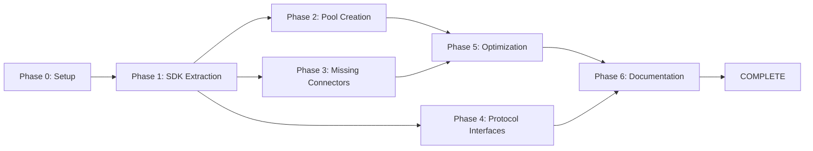

# Protocol SDK Project - Complete Implementation Plan

**Project Goal**: Transform HummingBot Gateway into a standalone, protocol-agnostic Protocol SDK while maintaining the REST API interface.

**Repository**: `nfttools/protocol-sdk` (private)
**Base**: Fork of `hummingbot/gateway` (commit: 2e35f341)
**Timeline**: 6 weeks (MVP in 3.5 weeks)
**Status**: Phase 0 - Repository Setup

---

## Table of Contents

1. [Executive Summary](#executive-summary)
2. [Current State Analysis](#current-state-analysis)
3. [Architecture Overview](#architecture-overview)
4. [Phase Breakdown](#phase-breakdown)
5. [PR Workflow](#pr-workflow)
6. [Testing Strategy](#testing-strategy)
7. [Risk Management](#risk-management)
8. [Success Metrics](#success-metrics)

---

## Executive Summary

### What We're Building

A protocol-agnostic DeFi SDK that:
- **Supports multiple protocol types**: DEX (AMM/CLMM), Prediction Markets, Lending, Token Launches
- **Works on multiple chains**: Solana, Ethereum, and EVM networks
- **Provides dual interfaces**: Pure SDK for programmatic use + REST API for HTTP access
- **Maintains backward compatibility**: Existing HummingBot integrations continue working
- **Optimized for low latency**: <100ms transaction build time

### Why Fork Gateway?

- ✅ **Battle-tested implementations**: Raydium, Meteora, Uniswap, PancakeSwap already working
- ✅ **Excellent architecture**: Clean separation, TypeScript, comprehensive tests
- ✅ **Saves 3-6 months**: Building from scratch would take significantly longer
- ❌ **Missing features**: Pool creation, Orca, Curve, Balancer need to be added
- ❌ **Too DEX-specific**: Current abstractions don't scale to other protocol types

### Key Changes

1. **Extract SDK layer**: Pure business logic separate from HTTP handling
2. **Protocol-agnostic interfaces**: Same patterns work for DEX, lending, prediction markets, etc.
3. **Add missing operations**: Pool creation for all protocols
4. **Add missing connectors**: Orca (Solana), Curve & Balancer (Ethereum)
5. **Extend to new protocol types**: Foundation for Polymarket, Pump.fun, Aave, etc.

---

## Current State Analysis

### ✅ What Gateway Already Has

**Solana Connectors:**
- **Raydium** (AMM + CLMM)
  - AMM: `addLiquidity`, `removeLiquidity`, `quoteLiquidity`, `executeSwap`, `quoteSwap`, `poolInfo`, `positionInfo`
  - CLMM: `openPosition`, `closePosition`, `addLiquidity`, `removeLiquidity`, `collectFees`, `positionsOwned`

- **Meteora** (CLMM/DLMM)
  - All CLMM operations + `fetchPools` for discovery

- **Jupiter** (Router)
  - `quoteSwap`, `executeSwap`, `executeQuote`

**Ethereum/EVM Connectors:**
- **Uniswap** (Router + AMM + CLMM)
  - Router: Universal Router with SOR integration
  - AMM: V2-style pool operations
  - CLMM: V3-style concentrated liquidity

- **PancakeSwap** (Router + AMM + CLMM)
  - Same structure as Uniswap (V2/V3 clones)

- **0x** (Router)
  - DEX aggregator with `quoteSwap`, `executeSwap`, `getPrice`

**Infrastructure:**
- Fastify REST API with Swagger documentation
- TypeBox schemas for type-safe validation
- Chain implementations (Ethereum, Solana) with wallet management
- RPC provider abstraction (Infura, Helius) with fallback
- Comprehensive test suite with mocks
- Hardware wallet support (Ledger)
- Config management with YAML + JSON schemas

### ❌ Critical Gaps

**Missing Operations:**
1. **Pool creation** - Not implemented for ANY connector
   - Raydium AMM factory
   - Raydium CLMM factory
   - Meteora DLMM factory
   - Uniswap V2/V3 factories
   - PancakeSwap V2/V3 factories

**Missing Connectors:**
2. **Orca** (Solana) - Major DEX with Whirlpools CLMM
3. **Curve** (Ethereum) - Dominant stable swap protocol
4. **Balancer** (Ethereum) - Weighted pool protocol

**Architecture Limitations:**
5. **DEX-specific abstractions** - Current structure (`amm-routes/`, `clmm-routes/`) doesn't scale to non-DEX protocols
6. **HTTP-coupled logic** - Business logic mixed with Fastify route handlers
7. **No SDK export** - Can't be used as a library, only via HTTP

---

## Architecture Overview

### Target Architecture

```
┌─────────────────────────────────────────────────────────────┐
│                         User Applications                    │
│  (Trading Bots, CLIs, Web Apps, Internal Services)         │
└────────────┬────────────────────────────────┬───────────────┘
             │                                │
             │ Direct SDK Import              │ HTTP REST API
             │                                │
┌────────────▼────────────────┐  ┌───────────▼───────────────┐
│     LP SDK (Pure Logic)     │  │   API Server (Fastify)    │
│  - Protocol implementations │  │  - Thin HTTP wrappers     │
│  - Transaction builders     │  │  - Same endpoints as now  │
│  - Chain abstractions       │◄─┤  - Calls SDK internally   │
└─────────────────────────────┘  └───────────────────────────┘
```

### Core Abstractions

**1. Protocol Interface** - Universal pattern for all protocol types

```typescript
interface Protocol<TConfig = any> {
  readonly chain: Chain;
  readonly network: string;
  readonly protocolType: ProtocolType;

  // Mutable actions that build transactions
  readonly operations: Record<string, OperationBuilder>;

  // Read-only data queries
  readonly queries: Record<string, QueryFunction>;

  initialize(config: TConfig): Promise<void>;
  healthCheck(): Promise<boolean>;
}
```

**2. Operation Builder** - Consistent pattern for all actions

```typescript
interface OperationBuilder<TParams, TResult> {
  // Validate parameters before building
  validate(params: TParams): Promise<ValidationResult>;

  // Simulate transaction execution
  simulate(params: TParams): Promise<SimulationResult>;

  // Build unsigned transaction
  build(params: TParams): Promise<Transaction>;

  // Execute transaction (optional - can be done externally)
  execute?(params: TParams): Promise<TResult>;
}
```

**3. Protocol Types** - First-class categories

```typescript
enum ProtocolType {
  DEX_AMM = 'dex-amm',              // Uniswap V2, Raydium AMM
  DEX_CLMM = 'dex-clmm',            // Uniswap V3, Raydium CLMM, Meteora
  DEX_ORDERBOOK = 'dex-orderbook',  // Serum, dYdX
  PREDICTION_MARKET = 'prediction-market',  // Polymarket
  LENDING = 'lending',              // Aave, Compound, Solend
  TOKEN_LAUNCH = 'token-launch',    // Pump.fun
  DERIVATIVES = 'derivatives',      // Hyperliquid
}
```

### SDK Usage Examples

**DEX Operations (Current):**
```typescript
import { ProtocolSDK } from '@nfttools/protocol-sdk';

const sdk = new ProtocolSDK({
  solana: { network: 'mainnet-beta' },
  ethereum: { network: 'mainnet' }
});

// Add liquidity to Raydium AMM
const tx = await sdk.solana.raydium.operations.addLiquidity.build({
  poolAddress: '...',
  baseAmount: 100,
  quoteAmount: 200,
  slippage: 1.0
});

// Get pool info
const pool = await sdk.solana.raydium.queries.getPool('...');
```

**Prediction Markets (Future):**
```typescript
// Buy outcome on Polymarket
const tx = await sdk.ethereum.polymarket.operations.buyOutcome.build({
  marketId: 'trump-2024',
  outcome: 'YES',
  amount: 1000,
  maxPrice: 0.65
});

// Get current odds
const odds = await sdk.ethereum.polymarket.queries.getOdds('trump-2024');
// { yes: 0.62, no: 0.38 }
```

**Lending (Future):**
```typescript
// Supply collateral to Aave
const tx = await sdk.ethereum.aave.operations.supply.build({
  asset: 'USDC',
  amount: 10000
});

// Check health factor
const health = await sdk.ethereum.aave.queries.getHealthFactor(walletAddress);
// 2.5
```

**Multi-step Workflows:**
```typescript
// Complex workflow: Supply → Borrow → Swap
const workflow = sdk.transaction
  .add(sdk.ethereum.aave.operations.supply, { asset: 'USDC', amount: 10000 })
  .add(sdk.ethereum.aave.operations.borrow, { asset: 'WETH', amount: 2 })
  .add(sdk.ethereum.uniswap.operations.swap, { tokenIn: 'WETH', tokenOut: 'USDC', amountIn: 2 });

const results = await workflow.execute({ mode: 'sequential' });
```

### Directory Structure

```
protocol-sdk/
├── docs/
│   ├── LP_SDK_PLAN.md          # This document
│   ├── ARCHITECTURE.md         # Technical architecture
│   ├── MIGRATION.md            # Migration from Gateway
│   └── API_REFERENCE.md        # Complete API docs
│
├── packages/
│   ├── core/                   # Shared types and utilities
│   │   ├── src/
│   │   │   ├── types/
│   │   │   │   ├── protocol.ts      # Base protocol interfaces
│   │   │   │   ├── operations.ts    # OperationBuilder types
│   │   │   │   ├── chains.ts        # Chain abstractions
│   │   │   │   └── transactions.ts  # Transaction types
│   │   │   ├── schemas/
│   │   │   │   ├── amm.ts           # AMM operation schemas
│   │   │   │   ├── clmm.ts          # CLMM operation schemas
│   │   │   │   ├── router.ts        # Router schemas
│   │   │   │   ├── lending.ts       # Lending schemas (future)
│   │   │   │   └── prediction.ts    # Prediction market schemas (future)
│   │   │   └── utils/
│   │   │       ├── transaction.ts   # Transaction helpers
│   │   │       ├── validation.ts    # Validation utilities
│   │   │       └── rpc.ts          # RPC utilities
│   │   ├── package.json
│   │   └── tsconfig.json
│   │
│   ├── sdk/                    # Pure SDK implementation
│   │   ├── src/
│   │   │   ├── index.ts        # Main SDK export
│   │   │   │
│   │   │   ├── solana/
│   │   │   │   ├── chain.ts         # SolanaChain class
│   │   │   │   ├── raydium/
│   │   │   │   │   ├── index.ts     # Main export
│   │   │   │   │   ├── connector.ts # Raydium class (from gateway)
│   │   │   │   │   ├── amm.ts       # AMM operations (extracted)
│   │   │   │   │   ├── clmm.ts      # CLMM operations (extracted)
│   │   │   │   │   ├── factory.ts   # Pool creation (NEW)
│   │   │   │   │   └── queries.ts   # Query operations
│   │   │   │   ├── meteora/
│   │   │   │   │   ├── connector.ts
│   │   │   │   │   ├── clmm.ts
│   │   │   │   │   ├── factory.ts   # Pool creation (NEW)
│   │   │   │   │   └── queries.ts
│   │   │   │   ├── orca/            # NEW CONNECTOR
│   │   │   │   │   ├── connector.ts
│   │   │   │   │   ├── clmm.ts
│   │   │   │   │   ├── factory.ts
│   │   │   │   │   └── queries.ts
│   │   │   │   └── jupiter/
│   │   │   │       ├── connector.ts
│   │   │   │       └── router.ts
│   │   │   │
│   │   │   └── ethereum/
│   │   │       ├── chain.ts         # EthereumChain class
│   │   │       ├── uniswap/
│   │   │       │   ├── connector.ts
│   │   │       │   ├── router.ts
│   │   │       │   ├── amm.ts
│   │   │       │   ├── clmm.ts
│   │   │       │   ├── factory.ts   # Pool creation (NEW)
│   │   │       │   └── queries.ts
│   │   │       ├── pancakeswap/
│   │   │       │   └── [same structure]
│   │   │       ├── curve/           # NEW CONNECTOR
│   │   │       │   ├── connector.ts
│   │   │       │   ├── stable-swap.ts
│   │   │       │   ├── factory.ts
│   │   │       │   └── queries.ts
│   │   │       ├── balancer/        # NEW CONNECTOR
│   │   │       │   ├── connector.ts
│   │   │       │   ├── weighted-pool.ts
│   │   │       │   ├── stable-pool.ts
│   │   │       │   ├── factory.ts
│   │   │       │   └── queries.ts
│   │   │       └── 0x/
│   │   │           └── router.ts
│   │   │
│   │   ├── package.json
│   │   └── tsconfig.json
│   │
│   └── api/                    # REST API wrapper (Fastify)
│       ├── src/
│       │   ├── server.ts            # Fastify setup (from gateway)
│       │   ├── app.ts              # App initialization
│       │   ├── routes/
│       │   │   ├── solana/
│       │   │   │   ├── raydium-routes.ts   # HTTP handlers
│       │   │   │   ├── meteora-routes.ts
│       │   │   │   └── orca-routes.ts
│       │   │   ├── ethereum/
│       │   │   │   ├── uniswap-routes.ts
│       │   │   │   ├── curve-routes.ts
│       │   │   │   └── balancer-routes.ts
│       │   │   ├── chains/
│       │   │   │   ├── solana-routes.ts
│       │   │   │   └── ethereum-routes.ts
│       │   │   ├── wallet-routes.ts
│       │   │   └── config-routes.ts
│       │   └── middleware/
│       │       ├── rate-limit.ts    # From gateway
│       │       ├── error-handler.ts
│       │       └── validation.ts
│       ├── package.json
│       └── tsconfig.json
│
├── examples/                   # Example projects
│   ├── basic-lp/
│   │   └── index.ts           # Simple LP bot
│   ├── arbitrage/
│   │   └── index.ts           # Cross-DEX arbitrage
│   └── position-manager/
│       └── index.ts           # Position management dashboard
│
├── tests/                      # Test suite (from gateway)
│   ├── sdk/
│   │   ├── solana/
│   │   │   ├── raydium.test.ts
│   │   │   └── meteora.test.ts
│   │   └── ethereum/
│   │       ├── uniswap.test.ts
│   │       └── curve.test.ts
│   ├── api/
│   │   └── integration.test.ts
│   └── mocks/                 # Mock data (from gateway)
│
├── scripts/                   # Utility scripts
│   ├── setup.sh              # Project setup
│   ├── test-devnet.sh        # Devnet testing
│   └── benchmark.ts          # Performance testing
│
├── package.json              # Root package.json
├── tsconfig.json             # Root TypeScript config
├── pnpm-workspace.yaml       # pnpm workspace config
└── README.md                 # Project README

```

---

## Phase Breakdown

### Phase 0: Repository Setup ⏳ IN PROGRESS

**Goal**: Fork Gateway, setup new repo, create comprehensive project plan

**Tasks:**
1. ✅ Analyze Gateway codebase structure
2. ✅ Design protocol-agnostic architecture
3. ✅ Create detailed implementation plan
4. ⏳ Fork Gateway to `nfttools/protocol-sdk` (private repo)
5. ⏳ Create project documentation structure

**Deliverables:**
- [ ] Private repo: `nfttools/protocol-sdk`
- [ ] Project plan: `LP_SDK_PLAN.md` (this document)
- [ ] Architecture doc: `ARCHITECTURE.md`
- [ ] Repository setup guide: `REPOSITORY_SETUP.md`

**Time Estimate**: 1 day

---

### Phase 1: SDK Extraction (Week 1)

**Goal**: Extract business logic from Gateway's route handlers into pure SDK functions while maintaining API compatibility

#### PR #1: Core SDK Structure & Raydium Extraction

**Branch**: `feature/sdk-core-structure`

**Objective**: Prove the dual SDK/API pattern works with Raydium connector

**Changes:**
1. Create `packages/` directory structure
2. Create `packages/core/` with types and schemas
3. Create `packages/sdk/solana/raydium/` directory
4. Extract business logic from `src/connectors/raydium/amm-routes/addLiquidity.ts`:
   - Move to `packages/sdk/solana/raydium/amm.ts` as pure function
   - Create `OperationBuilder` wrapper
5. Update route handler to call SDK function
6. Update tests to test both SDK and API
7. Add comprehensive documentation

**Files Modified:**
- `src/connectors/raydium/amm-routes/addLiquidity.ts` (simplified to HTTP wrapper)
- New: `packages/core/src/types/protocol.ts`
- New: `packages/core/src/types/operations.ts`
- New: `packages/sdk/src/solana/raydium/amm.ts`
- New: `packages/sdk/src/solana/raydium/connector.ts`
- New: `packages/sdk/src/index.ts`
- Updated: `test/connectors/raydium/amm-routes/addLiquidity.test.ts`

**Testing:**
- [ ] Unit tests for SDK function
- [ ] Integration test for API endpoint
- [ ] Verify existing HummingBot integration still works
- [ ] Test on devnet

**Definition of Done:**
- [ ] Raydium addLiquidity works in both SDK and API modes
- [ ] All tests pass
- [ ] Documentation shows both usage modes
- [ ] CI pipeline green
- [ ] Code reviewed and approved

**Time Estimate**: 2-3 days

---

#### PR #2: Complete Raydium SDK Extraction

**Branch**: `feature/sdk-raydium-complete`

**Objective**: Extract all remaining Raydium operations (AMM + CLMM)

**Changes:**
1. Extract all AMM operations:
   - `removeLiquidity`, `quoteLiquidity`, `executeSwap`, `quoteSwap`
   - `poolInfo`, `positionInfo`
2. Extract all CLMM operations:
   - `openPosition`, `closePosition`, `addLiquidity`, `removeLiquidity`
   - `collectFees`, `positionsOwned`, `quotePosition`
3. Update all route handlers to thin wrappers
4. Consolidate into `RaydiumProtocol` class implementing `DEXProtocol` interface

**Files Modified:**
- All files in `src/connectors/raydium/amm-routes/`
- All files in `src/connectors/raydium/clmm-routes/`
- New: `packages/sdk/src/solana/raydium/clmm.ts`
- New: `packages/sdk/src/solana/raydium/queries.ts`
- Updated: All Raydium tests

**Testing:**
- [ ] All Raydium operations work via SDK
- [ ] All API endpoints still functional
- [ ] Test coverage >80%
- [ ] Devnet validation

**Time Estimate**: 2 days

---

#### PR #3: Standardize All Connectors

**Branch**: `feature/sdk-all-connectors`

**Objective**: Apply SDK extraction pattern to all existing connectors

**Changes:**
1. Extract Meteora (CLMM)
2. Extract Uniswap (Router + AMM + CLMM)
3. Extract PancakeSwap (Router + AMM + CLMM)
4. Extract Jupiter (Router)
5. Extract 0x (Router)
6. Implement `Protocol` interface for each
7. Create chain-level SDK classes (`SolanaChain`, `EthereumChain`)
8. Main SDK export: `LPSDK` class

**Files Modified:**
- All connector files in `src/connectors/`
- New: `packages/sdk/src/solana/meteora/`
- New: `packages/sdk/src/ethereum/uniswap/`
- New: `packages/sdk/src/ethereum/pancakeswap/`
- New: `packages/sdk/src/solana/jupiter/`
- New: `packages/sdk/src/ethereum/0x/`
- New: `packages/sdk/src/solana/chain.ts`
- New: `packages/sdk/src/ethereum/chain.ts`
- Updated: `packages/sdk/src/index.ts` (main export)
- Updated: All connector tests

**Testing:**
- [ ] All connectors work via SDK
- [ ] All API endpoints unchanged
- [ ] Complete E2E test suite
- [ ] Performance benchmarks

**Definition of Done:**
- [ ] Clean SDK API: `sdk.solana.raydium.operations.addLiquidity.build()`
- [ ] All existing Gateway features work
- [ ] Zero breaking changes to API
- [ ] Documentation complete

**Time Estimate**: 3 days

---

### Phase 2: Pool Creation (Week 2)

**Goal**: Add missing pool creation functionality for all existing connectors

#### PR #4: Raydium Pool Creation

**Branch**: `feature/pool-creation-raydium`

**Objective**: Implement AMM and CLMM pool creation for Raydium

**Research Required:**
1. Raydium AMM factory contract interaction
2. Raydium CLMM pool initialization process
3. Initial price/liquidity requirements
4. Fee tier configuration

**Changes:**
1. Create `packages/sdk/src/solana/raydium/factory.ts`
2. Implement AMM pool creation:
   - Factory contract interaction
   - Initial liquidity provision
   - Pool initialization
3. Implement CLMM pool creation:
   - Pool configuration (bin step, fee tier)
   - Initial price setting
   - First position opening
4. Add to `raydium.operations.createPool`
5. Add API route: `POST /connectors/raydium/amm/createPool`
6. Add API route: `POST /connectors/raydium/clmm/createPool`

**Files Created:**
- `packages/sdk/src/solana/raydium/factory.ts`
- `src/connectors/raydium/amm-routes/createPool.ts` (API wrapper)
- `src/connectors/raydium/clmm-routes/createPool.ts` (API wrapper)
- `test/sdk/solana/raydium/factory.test.ts`

**Testing:**
- [ ] Unit tests with mocked transactions
- [ ] Devnet integration test (create real pool)
- [ ] Mainnet validation (small amounts, document results)
- [ ] Error handling (insufficient funds, invalid params)

**Documentation:**
- [ ] Pool creation guide with examples
- [ ] Parameter documentation
- [ ] Common errors and solutions

**Time Estimate**: 3 days

---

#### PR #5: Uniswap/PancakeSwap Pool Creation

**Branch**: `feature/pool-creation-uniswap`

**Objective**: Implement pool creation for Uniswap V2/V3 and PancakeSwap V2/V3

**Changes:**
1. Uniswap V2 factory integration
2. Uniswap V3 factory integration with fee tiers
3. PancakeSwap factory integration (mirrors Uniswap)
4. Add to operations and API routes

**Files Created:**
- `packages/sdk/src/ethereum/uniswap/factory.ts`
- `packages/sdk/src/ethereum/pancakeswap/factory.ts`
- API route files
- Test files

**Testing:**
- [ ] Sepolia testnet integration tests
- [ ] Mainnet validation on Ethereum
- [ ] Mainnet validation on BSC

**Time Estimate**: 2 days

---

#### PR #6: Meteora Pool Creation

**Branch**: `feature/pool-creation-meteora`

**Objective**: Implement DLMM pool creation for Meteora

**Changes:**
1. Meteora DLMM factory integration
2. Bin step configuration
3. Initial price and liquidity setup
4. Activation requirements

**Files Created:**
- `packages/sdk/src/solana/meteora/factory.ts`
- API routes
- Tests

**Testing:**
- [ ] Devnet testing
- [ ] Mainnet validation

**Time Estimate**: 2 days

---

### Phase 3: Missing Connectors (Weeks 3-4)

**Goal**: Add Orca, Curve, and Balancer connectors with full feature parity

#### PR #7: Orca Connector

**Branch**: `feature/connector-orca`

**Objective**: Full Orca Whirlpools support (CLMM operations + pool creation)

**Research Required:**
1. Orca Whirlpools SDK usage (already in dependencies: `@orca-so/common-sdk`)
2. Position management patterns
3. Fee collection mechanisms
4. Pool creation process

**Changes:**
1. Create `packages/sdk/src/solana/orca/` directory
2. Implement CLMM operations:
   - `openPosition`, `closePosition`
   - `addLiquidity`, `removeLiquidity`
   - `collectFees`, `positionsOwned`
   - `poolInfo`, `positionInfo`
3. Implement pool creation
4. Create API routes
5. Comprehensive tests

**Files Created:**
- `packages/sdk/src/solana/orca/connector.ts`
- `packages/sdk/src/solana/orca/clmm.ts`
- `packages/sdk/src/solana/orca/factory.ts`
- `packages/sdk/src/solana/orca/queries.ts`
- `src/connectors/orca/` (API routes)
- Test files

**Testing:**
- [ ] All CLMM operations on devnet
- [ ] Pool creation on devnet
- [ ] Mainnet validation
- [ ] Compare with Raydium feature parity

**Time Estimate**: 4 days

---

#### PR #8: Curve Connector

**Branch**: `feature/connector-curve`

**Objective**: Curve stable swap pool support with liquidity operations

**Research Required:**
1. Curve stable swap math
2. Metapool and factory pool differences
3. LP token management
4. Pool creation (if applicable - some pools are permissioned)

**Changes:**
1. Create `packages/sdk/src/ethereum/curve/` directory
2. Implement stable swap operations:
   - `addLiquidity` (single-sided and balanced)
   - `removeLiquidity` (single token and balanced)
   - `executeSwap`
   - `poolInfo`, `positionInfo`
3. Handle special pool types (3pool, meta pools)
4. Create API routes

**Files Created:**
- `packages/sdk/src/ethereum/curve/connector.ts`
- `packages/sdk/src/ethereum/curve/stable-swap.ts`
- `packages/sdk/src/ethereum/curve/queries.ts`
- `src/connectors/curve/` (API routes)
- Test files

**Testing:**
- [ ] Sepolia testnet
- [ ] Mainnet validation with major pools (3pool, etc.)
- [ ] Different pool types

**Time Estimate**: 3 days

---

#### PR #9: Balancer Connector

**Branch**: `feature/connector-balancer`

**Objective**: Balancer weighted pool support with multi-asset pools

**Research Required:**
1. Balancer V2 Vault architecture
2. Weighted pool math
3. Composable stable pools
4. Pool creation with custom weights

**Changes:**
1. Create `packages/sdk/src/ethereum/balancer/` directory
2. Implement weighted pool operations:
   - `addLiquidity` (proportional and single-sided)
   - `removeLiquidity` (proportional and single-sided)
   - `executeSwap`
   - `poolInfo`, `positionInfo`
3. Implement composable stable pools
4. Pool creation with weight configuration
5. Create API routes

**Files Created:**
- `packages/sdk/src/ethereum/balancer/connector.ts`
- `packages/sdk/src/ethereum/balancer/weighted-pool.ts`
- `packages/sdk/src/ethereum/balancer/stable-pool.ts`
- `packages/sdk/src/ethereum/balancer/factory.ts`
- `packages/sdk/src/ethereum/balancer/queries.ts`
- `src/connectors/balancer/` (API routes)
- Test files

**Testing:**
- [ ] Sepolia testnet
- [ ] Mainnet validation
- [ ] Different pool types and weights

**Time Estimate**: 4 days

---

### Phase 4: Multi-Protocol Foundation (Week 5)

**Goal**: Create interfaces and patterns for non-DEX protocol types

#### PR #10: Prediction Market Protocol Interface

**Branch**: `feature/protocol-prediction-markets`

**Objective**: Define standard interface for prediction market protocols (foundation for Polymarket)

**Changes:**
1. Create `packages/core/src/types/prediction-market.ts`
2. Define `PredictionMarketProtocol` interface
3. Define standard operations:
   - `createMarket(params: CreateMarketParams): Promise<Transaction>`
   - `buyOutcome(params: BuyOutcomeParams): Promise<Transaction>`
   - `sellOutcome(params: SellOutcomeParams): Promise<Transaction>`
   - `claimWinnings(params: ClaimParams): Promise<Transaction>`
4. Define standard queries:
   - `getMarket(marketId: string): Promise<MarketInfo>`
   - `getOdds(marketId: string): Promise<OddsInfo>`
   - `getPosition(user: string, market: string): Promise<Position>`
   - `getOrderbook(marketId: string): Promise<OrderbookData>`
5. Create schemas in `packages/core/src/schemas/prediction-market.ts`
6. Documentation and examples

**Files Created:**
- `packages/core/src/types/prediction-market.ts`
- `packages/core/src/schemas/prediction-market.ts`
- `docs/protocols/PREDICTION_MARKETS.md`

**Testing:**
- [ ] TypeScript compilation
- [ ] Schema validation tests
- [ ] Mock implementation for testing

**Time Estimate**: 1.5 days

---

#### PR #11: Lending Protocol Interface

**Branch**: `feature/protocol-lending`

**Objective**: Define standard interface for lending protocols (foundation for Aave, Compound, Solend)

**Changes:**
1. Create `packages/core/src/types/lending.ts`
2. Define `LendingProtocol` interface
3. Define standard operations:
   - `supply(params: SupplyParams): Promise<Transaction>`
   - `withdraw(params: WithdrawParams): Promise<Transaction>`
   - `borrow(params: BorrowParams): Promise<Transaction>`
   - `repay(params: RepayParams): Promise<Transaction>`
   - `liquidate(params: LiquidateParams): Promise<Transaction>`
4. Define standard queries:
   - `getUserPosition(address: string): Promise<LendingPosition>`
   - `getHealthFactor(address: string): Promise<number>`
   - `getMarket(asset: string): Promise<LendingMarketInfo>`
   - `getAPY(asset: string): Promise<APYInfo>`
5. Create schemas
6. Documentation

**Files Created:**
- `packages/core/src/types/lending.ts`
- `packages/core/src/schemas/lending.ts`
- `docs/protocols/LENDING.md`

**Testing:**
- [ ] TypeScript compilation
- [ ] Schema validation
- [ ] Mock implementation

**Time Estimate**: 1.5 days

---

#### PR #12: Token Launch Protocol Interface

**Branch**: `feature/protocol-token-launch`

**Objective**: Define standard interface for token launch platforms (foundation for Pump.fun)

**Changes:**
1. Create `packages/core/src/types/token-launch.ts`
2. Define `TokenLaunchProtocol` interface
3. Define standard operations:
   - `createToken(params: CreateTokenParams): Promise<Transaction>`
   - `buy(params: BuyTokenParams): Promise<Transaction>`
   - `sell(params: SellTokenParams): Promise<Transaction>`
   - `graduateToDEX(params: GraduateParams): Promise<Transaction>`
4. Define standard queries:
   - `getBondingCurve(token: string): Promise<BondingCurveInfo>`
   - `getPrice(token: string): Promise<PriceInfo>`
   - `getTokenInfo(token: string): Promise<TokenLaunchInfo>`
5. Create schemas
6. Documentation

**Files Created:**
- `packages/core/src/types/token-launch.ts`
- `packages/core/src/schemas/token-launch.ts`
- `docs/protocols/TOKEN_LAUNCH.md`

**Testing:**
- [ ] TypeScript compilation
- [ ] Schema validation
- [ ] Mock implementation

**Time Estimate**: 1.5 days

---

### Phase 5: Optimization (Week 6)

**Goal**: Performance optimization for low-latency transaction building

#### PR #13: Transaction Builder & Multi-Step Workflows

**Branch**: `feature/transaction-builder`

**Objective**: Enable complex multi-step workflows with simulation and batching

**Changes:**
1. Create `packages/core/src/transaction-builder.ts`
2. Implement fluent API for chaining operations
3. Add simulation support for entire workflow
4. Support atomic vs sequential execution modes
5. Error handling and rollback strategies
6. Transaction status tracking

**Example Usage:**
```typescript
const workflow = sdk.transaction
  .add(sdk.ethereum.aave.operations.supply, { asset: 'USDC', amount: 10000 })
  .add(sdk.ethereum.aave.operations.borrow, { asset: 'WETH', amount: 2 })
  .add(sdk.ethereum.uniswap.operations.swap, { tokenIn: 'WETH', tokenOut: 'USDC', amountIn: 2 });

// Simulate before executing
const simulation = await workflow.simulate();

// Execute
const results = await workflow.execute({ mode: 'sequential' });
```

**Files Created:**
- `packages/core/src/transaction-builder.ts`
- `packages/sdk/src/workflow.ts`
- Test files
- Documentation

**Testing:**
- [ ] Multi-step DEX operations
- [ ] Simulation accuracy
- [ ] Error handling
- [ ] Performance benchmarks

**Time Estimate**: 2 days

---

#### PR #14: Performance Optimization

**Branch**: `feature/performance-optimization`

**Objective**: Achieve <100ms transaction build time

**Changes:**
1. **RPC Call Batching**
   - Implement request batching for Solana/Ethereum
   - Reduce round trips to RPC nodes

2. **Connection Pooling**
   - Connection warming on startup
   - Keep-alive for RPC connections
   - Regional optimization for Helius

3. **Smart Caching**
   - Cache pool data with TTLs
   - Cache token metadata
   - Invalidate on-demand

4. **Parallel Operations**
   - Parallelize independent operations
   - Optimize transaction building pipeline

5. **Code Optimization**
   - Profile hot paths
   - Optimize data structures
   - Reduce allocations

**Files Modified:**
- `packages/core/src/utils/rpc.ts`
- `packages/sdk/src/solana/chain.ts`
- `packages/sdk/src/ethereum/chain.ts`
- All connector query functions

**Testing:**
- [ ] Benchmark suite for all operations
- [ ] Compare before/after performance
- [ ] Load testing
- [ ] Memory profiling

**Performance Targets:**
- Single operation: <100ms
- Multi-step workflow (3 ops): <200ms
- Pool info query: <50ms
- Position info query: <75ms

**Time Estimate**: 2 days

---

#### PR #15: Monitoring & Observability

**Branch**: `feature/monitoring`

**Objective**: Production-ready performance monitoring and observability

**Changes:**
1. **Performance Metrics**
   - Transaction build time tracking
   - RPC latency monitoring
   - Operation success/failure rates
   - Cache hit rates

2. **Logging**
   - Structured logging with correlation IDs
   - Log levels and filtering
   - Performance log entries

3. **Health Checks**
   - RPC provider health
   - Operation availability
   - System health endpoint

4. **Alerting**
   - Slow operation detection
   - RPC failure alerts
   - Error rate thresholds

**Files Created:**
- `packages/core/src/monitoring/metrics.ts`
- `packages/core/src/monitoring/health.ts`
- `packages/api/src/routes/health.ts`
- Documentation

**Testing:**
- [ ] Metrics collection works
- [ ] Health checks accurate
- [ ] Logs properly structured
- [ ] Alerts trigger correctly

**Time Estimate**: 1 day

---

### Phase 6: Documentation & Polish (Week 6)

**Goal**: Production-ready documentation and example projects

#### PR #16: Comprehensive Documentation

**Branch**: `feature/documentation`

**Objective**: Complete developer documentation for all features

**Changes:**
1. **API Reference**
   - Complete API documentation for all protocols
   - Parameter descriptions
   - Return type documentation
   - Error codes

2. **SDK Usage Guide**
   - Getting started guide
   - Installation instructions
   - Configuration guide
   - Usage examples for each protocol

3. **Migration Guide**
   - Migrate from Gateway API to SDK
   - Breaking changes (if any)
   - Migration examples

4. **Architecture Documentation**
   - System architecture
   - Protocol interface design
   - Extension guide for new protocols

5. **API Documentation**
   - REST API reference
   - Swagger/OpenAPI updates
   - Authentication (if added)

**Files Created:**
- `docs/API_REFERENCE.md`
- `docs/SDK_GUIDE.md`
- `docs/MIGRATION.md`
- `docs/ARCHITECTURE.md`
- `docs/protocols/` (protocol-specific docs)
- Updated README.md

**Time Estimate**: 2 days

---

#### PR #17: Example Projects

**Branch**: `feature/examples`

**Objective**: Reference implementations demonstrating SDK usage

**Changes:**
1. **Basic LP Bot**
   - Simple liquidity provision bot
   - Monitors pool prices
   - Auto-rebalances positions

2. **Multi-Protocol Arbitrage**
   - Cross-DEX arbitrage scanner
   - Transaction builder usage
   - Real-time price monitoring

3. **Position Manager Dashboard**
   - Web dashboard showing all positions
   - Position performance tracking
   - Fee collection automation

**Files Created:**
- `examples/basic-lp/`
- `examples/arbitrage/`
- `examples/position-manager/`
- Documentation for each

**Testing:**
- [ ] All examples run successfully
- [ ] Clear setup instructions
- [ ] Work on devnet and mainnet

**Time Estimate**: 1 day

---

## PR Workflow & Guidelines

### Branch Naming Convention

```
feature/short-description    # New features
bugfix/issue-description     # Bug fixes
refactor/component-name      # Refactoring
docs/section-name           # Documentation
test/component-name         # Test improvements
```

### PR Size Guidelines

**Target Sizes:**
- **Ideal**: 200-500 lines changed
- **Acceptable**: 500-1000 lines changed
- **Avoid**: >1000 lines changed (split into smaller PRs)

**What Counts as Lines Changed:**
- Source code additions/deletions
- Test code additions/deletions
- Does not count: Generated code, lockfiles, vendored code

### PR Template

All PRs must use this template:

```markdown
## Description

[Clear description of what this PR does and why]

## Related Issues

Closes #XXX
Related to #YYY

## Type of Change

- [ ] New feature (non-breaking change which adds functionality)
- [ ] Bug fix (non-breaking change which fixes an issue)
- [ ] Refactoring (no functional changes)
- [ ] Documentation update
- [ ] Performance improvement
- [ ] Breaking change (fix or feature that would cause existing functionality to not work as expected)

## Testing

### Unit Tests
- [ ] Unit tests added for new functionality
- [ ] Existing unit tests updated
- [ ] All unit tests pass locally

### Integration Tests
- [ ] Integration tests added/updated
- [ ] Tested on devnet
- [ ] Tested on mainnet (if applicable)

### Manual Testing
[Describe manual testing performed]

## Performance Impact

- [ ] No performance impact
- [ ] Performance improved
- [ ] Performance degraded (explain why acceptable)

### Benchmarks
[Include benchmark results if applicable]

## Checklist

- [ ] Code follows project style guide
- [ ] Self-review completed
- [ ] Comments added for complex logic
- [ ] Documentation updated
- [ ] No console.log or debug statements
- [ ] TypeScript types are correct (no `any` unless necessary)
- [ ] Error handling is comprehensive
- [ ] No secrets or API keys in code

## Screenshots/Videos

[If UI changes, include screenshots or videos]

## Additional Notes

[Any additional context, concerns, or discussion points]
```

### PR Review Process

**1. Self-Review (Author)**
- Review own PR before requesting review
- Ensure all checklist items completed
- Test locally one more time
- Add inline comments explaining complex logic

**2. Automated Checks (CI)**
- TypeScript compilation
- ESLint passing
- Prettier formatting
- Unit tests passing (>80% coverage)
- Integration tests passing

**3. Peer Review (Reviewers)**
- At least 1 approval required for merge
- Focus areas:
  - Code correctness and logic
  - Performance implications
  - Security concerns
  - Documentation clarity
  - Test coverage

**4. Merge Strategy**
- **Squash and merge** for feature PRs (clean history)
- **Rebase and merge** for small bug fixes (preserve commits)
- Never use regular merge (creates merge commits)

**5. Post-Merge**
- Delete feature branch
- Verify merge completed successfully

### Code Review Standards

**Reviewers Should Check:**
- [ ] Code is clear and understandable
- [ ] No obvious bugs or logic errors
- [ ] Error handling is appropriate
- [ ] Performance implications considered
- [ ] Security best practices followed
- [ ] Tests are meaningful and comprehensive
- [ ] Documentation is accurate and helpful
- [ ] No unnecessary complexity
- [ ] TypeScript types are correct
- [ ] Follows existing patterns and conventions

**Review Comments:**
- Be constructive and specific
- Explain *why* something should change
- Suggest alternatives when blocking
- Use conventional comment prefixes:
  - `nit:` Minor style/formatting issue (non-blocking)
  - `question:` Asking for clarification
  - `suggestion:` Alternative approach
  - `blocker:` Must be addressed before merge
  - `praise:` Highlight good work

---

## Testing Strategy

### Test Pyramid

```
        /\
       /  \      E2E Tests (Few)
      /____\     - Real blockchain interactions
     /      \    - Expensive, slow
    /________\   Integration Tests (Some)
   /          \  - Mock RPC, real SDK logic
  /____________\ Unit Tests (Many)
                 - Fast, isolated
                 - 80%+ coverage target
```

### Unit Tests (Jest)

**Coverage Targets:**
- Core types: 100%
- Operation builders: >90%
- Connector logic: >85%
- Utilities: >90%
- **Overall: >80%**

**What to Test:**
- Pure functions with different inputs
- Error handling paths
- Edge cases and boundary conditions
- Type conversions and validations

**Example:**
```typescript
describe('RaydiumAMM.addLiquidity', () => {
  it('should build valid transaction with correct parameters', async () => {
    const params = {
      poolAddress: 'abc...',
      baseAmount: 100,
      quoteAmount: 200,
      slippage: 1.0
    };

    const tx = await raydium.operations.addLiquidity.build(params);

    expect(tx).toBeDefined();
    expect(tx.instructions).toHaveLength(3); // Approve x2 + add
  });

  it('should throw error with invalid pool address', async () => {
    const params = {
      poolAddress: 'invalid',
      baseAmount: 100,
      quoteAmount: 200
    };

    await expect(
      raydium.operations.addLiquidity.build(params)
    ).rejects.toThrow('Invalid pool address');
  });
});
```

### Integration Tests

**Test Environments:**
- **Devnet**: Primary testing environment
- **Testnet**: Secondary validation (Sepolia for Ethereum)
- **Mainnet**: Manual validation only

**What to Test:**
- Complete operation flows (quote → execute)
- Multi-step workflows
- RPC provider interactions (with mocked responses)
- Error recovery and retries

**Example:**
```typescript
describe('Raydium Integration', () => {
  it('should complete full LP workflow on devnet', async () => {
    const sdk = new ProtocolSDK({
      solana: { network: 'devnet', rpc: process.env.DEVNET_RPC }
    });

    // Get quote
    const quote = await sdk.solana.raydium.queries.quoteLiquidity({
      poolAddress: DEVNET_POOL,
      baseAmount: 1,
      quoteAmount: 2
    });

    expect(quote.baseTokenAmount).toBeCloseTo(1, 2);

    // Build transaction
    const tx = await sdk.solana.raydium.operations.addLiquidity.build({
      poolAddress: DEVNET_POOL,
      baseAmount: quote.baseTokenAmount,
      quoteAmount: quote.quoteTokenAmount
    });

    expect(tx).toBeDefined();
    expect(tx.instructions.length).toBeGreaterThan(0);
  });
});
```

### Mainnet Validation

**When Required:**
- Pool creation features (critical to validate)
- New connector implementations
- Breaking changes to existing connectors

**Process:**
1. Test on devnet thoroughly first
2. Test on testnet if available
3. Test on mainnet with **minimal amounts** (e.g., $10-50)
4. Document transaction signatures
5. Verify expected behavior
6. Update PR with validation results

**Documentation Template:**
```markdown
## Mainnet Validation

### Pool Creation - Raydium AMM
- **Date**: 2025-01-15
- **Network**: Solana Mainnet
- **Transaction**: https://solscan.io/tx/abc123...
- **Result**: SUCCESS
- **Pool Address**: xyz789...
- **Initial Liquidity**: 0.1 SOL + 20 USDC
- **Notes**: Pool created successfully, first LP position opened

### Issues Encountered
- None
```

### Performance Tests

**Benchmarking Suite:**
```typescript
describe('Performance Benchmarks', () => {
  it('should build Raydium addLiquidity tx in <100ms', async () => {
    const start = performance.now();

    await sdk.solana.raydium.operations.addLiquidity.build(params);

    const duration = performance.now() - start;
    expect(duration).toBeLessThan(100);
  });

  it('should handle 100 concurrent pool queries', async () => {
    const queries = Array(100).fill(null).map(() =>
      sdk.solana.raydium.queries.getPool(POOL_ADDRESS)
    );

    const start = performance.now();
    await Promise.all(queries);
    const duration = performance.now() - start;

    expect(duration).toBeLessThan(5000); // 5s for 100 queries
  });
});
```

**Performance Targets:**
| Operation | Target | Acceptable | Poor |
|-----------|--------|------------|------|
| Single tx build | <100ms | <200ms | >200ms |
| Pool query | <50ms | <100ms | >100ms |
| Position query | <75ms | <150ms | >150ms |
| Multi-step workflow (3 ops) | <200ms | <400ms | >400ms |

### Test Execution

**Local Development:**
```bash
# Run all tests
pnpm test

# Run specific test file
pnpm test packages/sdk/src/solana/raydium/amm.test.ts

# Run with coverage
pnpm test:cov

# Run in watch mode
pnpm test:watch
```

---

## Risk Management

### Technical Risks

#### 1. Pool Creation Complexity

**Risk Level**: HIGH
**Impact**: Pool creation is complex and error-prone. Mistakes can result in locked funds or unusable pools.

**Mitigation:**
- Extensive devnet testing before mainnet
- Thorough review of factory contract interactions
- Reference implementation analysis (copy proven patterns)
- Mainnet validation with minimal amounts ($10-50)
- Clear documentation of requirements and gotchas
- Community review period before marking stable

**Acceptance Criteria:**
- [ ] Successful pool creation on devnet
- [ ] Successful pool creation on mainnet (3 different pools)
- [ ] Comprehensive error handling
- [ ] Clear error messages for common issues

---

#### 2. Protocol SDK Breaking Changes

**Risk Level**: MEDIUM
**Impact**: Third-party protocol SDKs (Raydium, Meteora, Orca, etc.) may release breaking changes.

**Mitigation:**
- Pin exact dependency versions in package.json
- Use `pnpm` lockfile for reproducible builds
- Monitor protocol SDK changelogs
- Test against multiple SDK versions
- Maintain compatibility layer if needed
- Comprehensive test coverage catches breakages early

**Monitoring:**
- Dependabot alerts for security issues
- Monthly review of protocol SDK updates
- Documented upgrade process

---

#### 3. Performance Bottlenecks

**Risk Level**: MEDIUM
**Impact**: Unable to meet <100ms transaction build time target.

**Mitigation:**
- Early performance benchmarking (PR #2)
- Profile before optimizing (identify actual bottlenecks)
- Implement caching strategically
- RPC call batching and connection pooling
- Parallel operation execution where possible
- Set realistic fallback targets if <100ms not achievable

**Checkpoints:**
- Week 2: Initial benchmark (establish baseline)
- Week 4: Mid-project benchmark (identify issues)
- Week 6: Final optimization (reach target)

---

#### 4. RPC Rate Limiting

**Risk Level**: MEDIUM
**Impact**: Public RPC endpoints may rate limit during heavy testing.

**Mitigation:**
- Use rate-limited RPC providers (Helius, Infura) with API keys
- Implement request queuing and retry logic
- Cache aggressively where appropriate
- Respect rate limits in code
- Fallback to alternative RPC if primary throttled

**Best Practices:**
- Never use public RPC in production
- Document RPC provider setup clearly
- Test with production-grade RPC providers

---

### Operational Risks

#### 5. Mainnet Testing Costs

**Risk Level**: LOW
**Impact**: Testing on mainnet costs real money (gas fees, token costs).

**Mitigation:**
- Maximize devnet testing first
- Use testnet (Sepolia) for Ethereum when possible
- Mainnet testing with minimal amounts only ($10-50)
- Document all mainnet transactions for expense tracking
- Pool creation testing: only 3-5 pools needed

**Budget Estimate:**
- Solana mainnet: ~$50 (5 pool creations @ ~$10 each)
- Ethereum mainnet: ~$100 (2 pool creations @ ~$50 each)
- **Total**: ~$150

---

#### 6. Breaking Changes to API

**Risk Level**: LOW
**Impact**: Existing HummingBot integrations break.

**Mitigation:**
- Maintain 100% API compatibility during refactor
- API routes remain unchanged (thin wrappers around SDK)
- Extensive integration testing
- Version API endpoints if breaking changes needed (v1, v2)
- Clear deprecation warnings and migration guides

**Validation:**
- [ ] All existing Gateway endpoints work identically
- [ ] HummingBot integration test suite passes
- [ ] No changes to request/response schemas

---

#### 7. Third-Party API Dependencies

**Risk Level**: LOW
**Impact**: External APIs (RPC providers, price feeds) may be unreliable.

**Mitigation:**
- Implement retry logic with exponential backoff
- Graceful error handling and clear error messages
- Fallback RPC providers
- Timeout enforcement
- Health checks for external dependencies

**Error Handling Example:**
```typescript
async function getPoolInfo(address: string): Promise<PoolInfo> {
  const maxRetries = 3;
  let lastError: Error;

  for (let i = 0; i < maxRetries; i++) {
    try {
      return await fetchPoolInfo(address);
    } catch (error) {
      lastError = error;
      if (i < maxRetries - 1) {
        await sleep(2 ** i * 1000); // Exponential backoff
      }
    }
  }

  throw new Error(`Failed to get pool info after ${maxRetries} attempts: ${lastError.message}`);
}
```

---

## Success Metrics

### Phase Completion Criteria

#### Phase 0: Repository Setup ✓

- [ ] Private repo `nfttools/protocol-sdk` created and accessible
- [ ] Fork from Gateway completed (commit: 2e35f341)
- [ ] Project plan document (`LP_SDK_PLAN.md`) created
- [ ] Architecture document (`ARCHITECTURE.md`) created
- [ ] All project documentation in place

---

#### Phase 1: SDK Extraction ✓

- [ ] SDK can be imported as library: `import { ProtocolSDK } from '@nfttools/protocol-sdk'`
- [ ] All existing connectors work in SDK mode
- [ ] All existing API endpoints still functional (backward compatible)
- [ ] Clean SDK API: `sdk.solana.raydium.operations.addLiquidity.build()`
- [ ] Zero breaking changes to Gateway API
- [ ] All existing tests passing
- [ ] Test coverage maintained (>80%)
- [ ] Documentation shows both SDK and API usage
- [ ] Example project using SDK directly

**Validation:**
```bash
# SDK usage should work
import { ProtocolSDK } from '@nfttools/protocol-sdk';
const sdk = new ProtocolSDK({ solana: { network: 'devnet' } });
const tx = await sdk.solana.raydium.operations.addLiquidity.build({...});

# API still works
curl -X POST http://localhost:15888/connectors/raydium/amm/addLiquidity \
  -d '{"poolAddress": "...", "baseAmount": 100, ...}'
```

---

#### Phase 2: Pool Creation ✓

- [ ] Pool creation implemented for ALL connectors:
  - [ ] Raydium AMM
  - [ ] Raydium CLMM
  - [ ] Meteora DLMM
  - [ ] Uniswap V2
  - [ ] Uniswap V3
  - [ ] PancakeSwap V2
  - [ ] PancakeSwap V3
- [ ] Devnet validation successful for all
- [ ] Mainnet validation successful with documented results:
  - [ ] At least 2 Solana pools created (Raydium + Meteora)
  - [ ] At least 2 Ethereum pools created (Uniswap V2 + V3)
- [ ] Transaction signatures documented
- [ ] Error handling comprehensive
- [ ] Documentation with examples and common issues

**Validation:**
- Mainnet transaction links for each protocol
- Pools are usable (can add/remove liquidity)
- No locked funds or unusable pools

---

#### Phase 3: Missing Connectors ✓

- [ ] Orca connector fully functional:
  - [ ] All CLMM operations working
  - [ ] Pool creation working
  - [ ] Feature parity with Raydium
  - [ ] Test coverage >80%
- [ ] Curve connector fully functional:
  - [ ] Stable swap operations working
  - [ ] Multiple pool types supported
  - [ ] Test coverage >80%
- [ ] Balancer connector fully functional:
  - [ ] Weighted pool operations working
  - [ ] Pool creation with custom weights
  - [ ] Test coverage >80%
- [ ] All connectors tested on mainnet
- [ ] Documentation for each new connector

**Connector Count:**
- Solana: 4 (Raydium, Meteora, Orca, Jupiter)
- Ethereum: 5 (Uniswap, PancakeSwap, Curve, Balancer, 0x)
- **Total: 9 protocol connectors**

---

#### Phase 4: Multi-Protocol Foundation ✓

- [ ] Protocol interfaces defined:
  - [ ] `PredictionMarketProtocol`
  - [ ] `LendingProtocol`
  - [ ] `TokenLaunchProtocol`
- [ ] TypeScript types compile correctly
- [ ] Schemas for all protocol types
- [ ] Mock implementations for testing
- [ ] Documentation for each protocol type
- [ ] Clear examples of future usage

**Validation:**
- New protocols can be added by implementing interface
- No changes to core SDK required for new protocol types
- Examples show how Polymarket/Aave/Pump.fun would integrate

---

#### Phase 5: Optimization ✓

- [ ] Transaction build time performance:
  - [ ] Single operation: <100ms (target met)
  - [ ] Multi-step workflow (3 ops): <200ms
  - [ ] Pool query: <50ms
  - [ ] Position query: <75ms
- [ ] RPC call optimization:
  - [ ] Batching implemented
  - [ ] Connection pooling active
  - [ ] Smart caching with TTLs
- [ ] Monitoring system in place:
  - [ ] Performance metrics collected
  - [ ] Health check endpoint working
  - [ ] Structured logging active
- [ ] Load testing completed
- [ ] No memory leaks detected

**Benchmark Results:**
- Document before/after performance
- Show improvement percentages
- Identify any remaining bottlenecks

---

#### Phase 6: Documentation & Polish ✓

- [ ] Complete API reference documentation
- [ ] SDK usage guide with examples
- [ ] Migration guide from Gateway
- [ ] Architecture documentation
- [ ] Protocol-specific documentation
- [ ] Example projects:
  - [ ] Basic LP bot working
  - [ ] Arbitrage bot working
  - [ ] Position manager dashboard working
- [ ] README.md comprehensive
- [ ] All documentation reviewed and accurate

---

### Final Success Criteria

Before marking project as **COMPLETE**, all of the following must be true:

**Functionality:**
- [ ] All 17 PRs merged and deployed
- [ ] SDK works as standalone library
- [ ] API maintains backward compatibility
- [ ] 9 protocol connectors fully functional
- [ ] Pool creation works for all connectors
- [ ] 3 protocol interface types defined

**Quality:**
- [ ] Test coverage >80%
- [ ] All CI checks passing
- [ ] No critical bugs in issue tracker
- [ ] Performance targets met (<100ms)
- [ ] Code review standards followed

**Documentation:**
- [ ] Complete API reference
- [ ] SDK usage guide
- [ ] Migration guide
- [ ] Example projects
- [ ] All features documented

**Validation:**
- [ ] Mainnet testing successful
- [ ] Integration tests passing
- [ ] Performance benchmarks green
- [ ] Example projects working

**Production Readiness:**
- [ ] Monitoring and observability in place
- [ ] Error handling comprehensive
- [ ] Security review completed
- [ ] Dependency audit clean

---

## Timeline & Milestones

### Week-by-Week Schedule

| Week | Phase | PRs | Key Deliverables | Status |
|------|-------|-----|------------------|--------|
| 0 (Now) | Phase 0 | Setup | Repo setup, project plan | 🏗️ IN PROGRESS |
| 1 | Phase 1 | #1-#3 | SDK extraction, all connectors | 📋 PLANNED |
| 2 | Phase 2 | #4-#6 | Pool creation for all | 📋 PLANNED |
| 3 | Phase 3 | #7-#8 | Orca + Curve connectors | 📋 PLANNED |
| 4 | Phase 3 | #9 | Balancer connector | 📋 PLANNED |
| 5 | Phase 4 | #10-#12 | Protocol interfaces | 📋 PLANNED |
| 6 | Phase 5 & 6 | #13-#17 | Optimization + docs | 📋 PLANNED |

### Critical Path



**Critical Path:** Phase 0 → Phase 1 → Phase 2 → Phase 5 → Phase 6

**Parallel Work:** Phase 3 and Phase 4 can be done concurrently with other phases

### Milestones

**🎯 Milestone 1: MVP SDK (Week 2)**
- SDK extraction complete
- Pool creation for existing connectors
- **Deliverable**: Working SDK for Raydium + Meteora + Uniswap

**🎯 Milestone 2: Feature Complete (Week 4)**
- All missing connectors added
- Protocol interfaces defined
- **Deliverable**: 9 connectors + extensible architecture

**🎯 Milestone 3: Production Ready (Week 6)**
- Performance optimized
- Documentation complete
- **Deliverable**: Production-ready LP SDK

---

## Next Steps

### Immediate Actions (Phase 0)

1. **Create GitHub Repository**
   ```bash
   # This requires GitHub access - will document steps
   # 1. Go to github.com/nfttools
   # 2. Create new private repository: protocol-sdk
   # 3. Clone locally
   # 4. Add gateway as remote and pull
   ```

2. **Initialize Documentation**
   - [x] Create `LP_SDK_PLAN.md` (this document)
   - [ ] Create `ARCHITECTURE.md`
   - [ ] Create `REPOSITORY_SETUP.md`
   - [ ] Update `README.md`

3. **Team Alignment**
   - [ ] Review and approve this plan
   - [ ] Assign PR owners
   - [ ] Set up communication channels
   - [ ] Schedule weekly sync meetings

### Phase 1 Kickoff (Week 1)

Once Phase 0 is complete:

1. Create feature branch: `feature/sdk-core-structure`
2. Begin PR #1: Core SDK Structure & Raydium Extraction
3. First PR review by end of Week 1

---

## Appendix

### A. Technology Stack

**Core:**
- TypeScript 5.8+
- Node.js 20+
- pnpm (package manager)

**Frameworks:**
- Fastify (REST API)
- Jest (testing)
- TypeBox (schema validation)

**Blockchain SDKs:**
- `@solana/web3.js` (Solana)
- `ethers` v5 (Ethereum)
- `@raydium-io/raydium-sdk-v2`
- `@meteora-ag/dlmm`
- `@orca-so/common-sdk`
- `@uniswap/v3-sdk`, `@uniswap/v2-sdk`
- Protocol-specific SDKs as needed

**Development:**
- ESLint + Prettier (code quality)
- Husky (git hooks)
- TypeScript strict mode
- Conventional commits

### B. Code Style Guide

**TypeScript:**
- Use `interface` for public APIs
- Use `type` for internal types
- Prefer `const` over `let`
- Use arrow functions
- Explicit return types for public functions

**Naming:**
- `PascalCase` for types/interfaces/classes
- `camelCase` for functions/variables
- `SCREAMING_SNAKE_CASE` for constants
- Prefix interfaces with `I` only if needed for clarity

**Files:**
- One export per file (default export preferred)
- File name matches export name
- Group related functionality
- Keep files under 300 lines

**Comments:**
- Use JSDoc for public APIs
- Explain *why*, not *what*
- No commented-out code
- TODO comments must have issue numbers

### C. Contact & Support

**Project Lead:** [Your Name]
**Repository:** `github.com/nfttools/protocol-sdk` (private)
**Discord:** [Project Channel]
**Issue Tracker:** GitHub Issues

---

## Document Version

- **Version**: 1.0
- **Last Updated**: 2025-01-23
- **Status**: DRAFT → APPROVED (pending)
- **Next Review**: After Phase 1 completion

---

**This is a living document. It will be updated as the project progresses and requirements evolve.**
