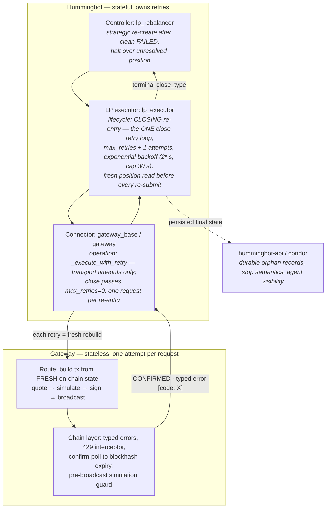
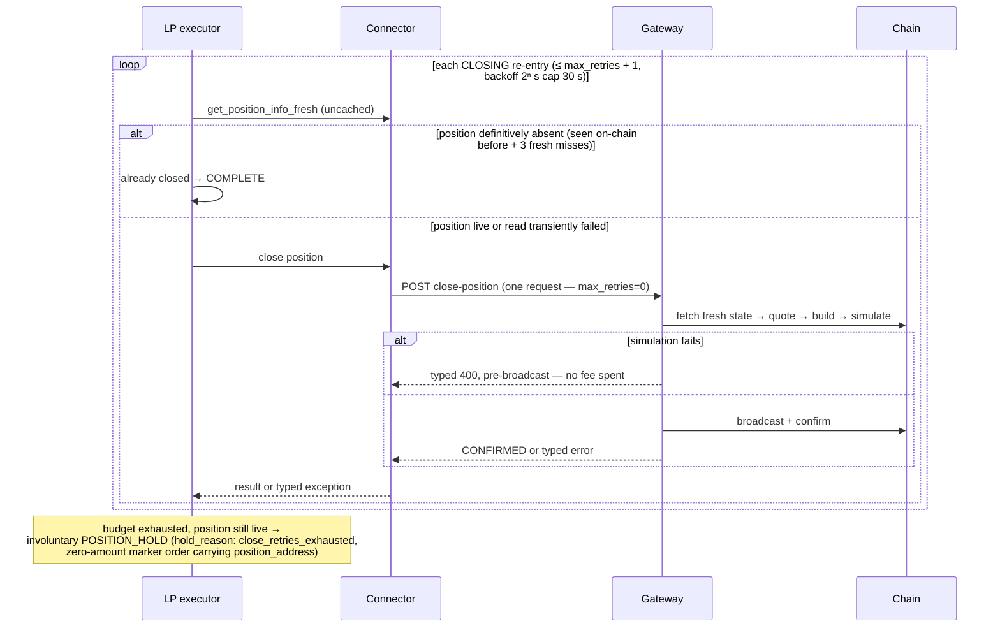
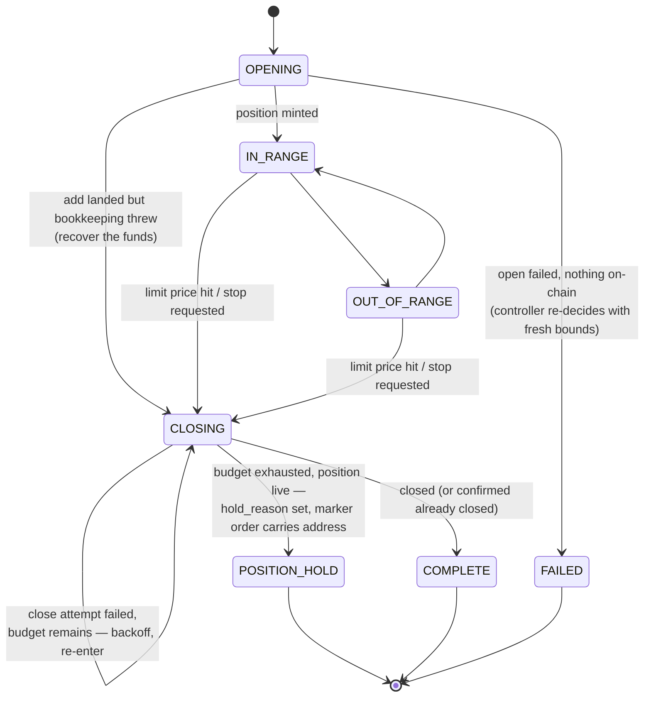
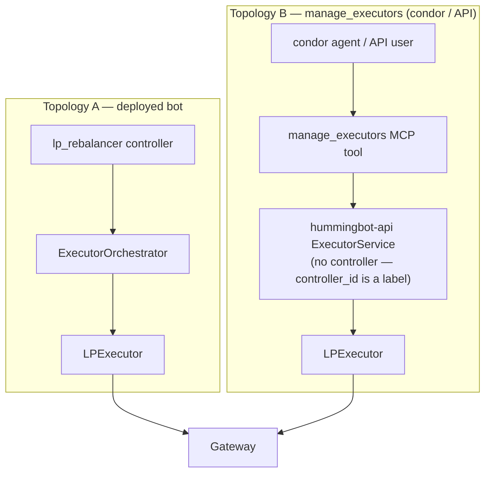
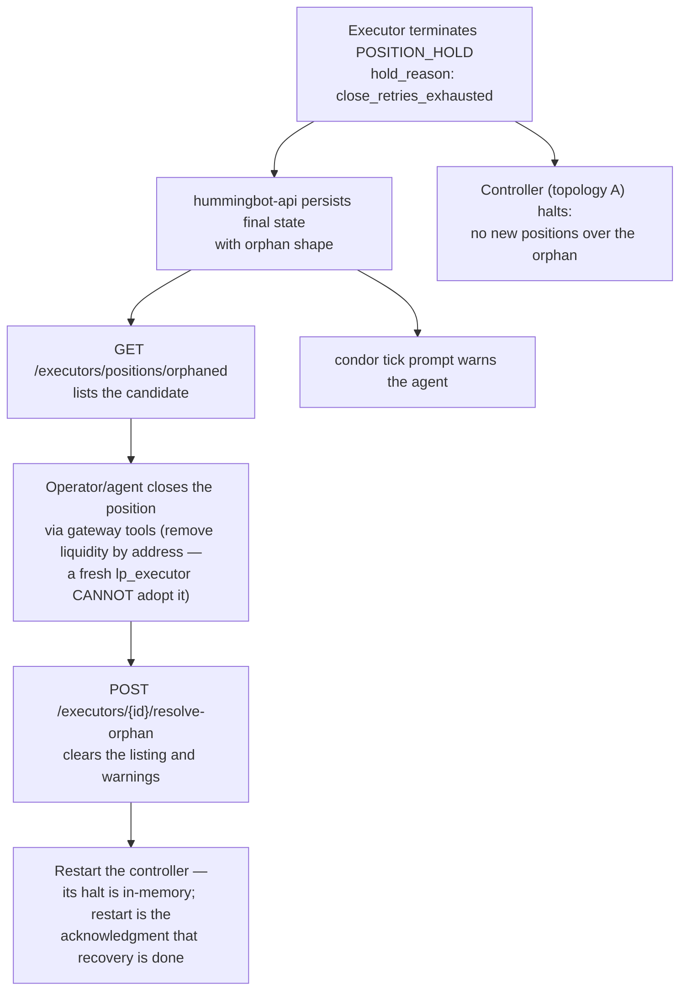

# LP Close Retry Architecture

**Origin:** [gateway#678](https://github.com/hummingbot/gateway/issues/678) — an Orca LP close failed with Whirlpool error `6018` (`TokenMinSubceeded`, misreported as `MATH_OVERFLOW`), the LP executor went terminally `FAILED` with the position still open on-chain, and subsequent stop requests returned 404. Fixing it properly required deciding **where retries live** across Gateway, the Hummingbot connector, the LP executor, the controller, and hummingbot-api — and auditing every layer against that model. This document describes the issues found and the architecture that now stands, spanning four repositories (gateway, hummingbot, hummingbot-api, condor).

---

## 1. The principle

> **Gateway is a stateless transaction oracle.** One HTTP request = one attempt at one on-chain action, built from fresh on-chain state, answered with either a confirmed result or a **typed error**. Hummingbot holds the position and order state, so Hummingbot owns retries — at distinct altitudes, each answering a different question.

| Layer | Question it answers | What it owns |
|---|---|---|
| **Gateway** | "Did *this one attempt* land?" | Reads and transport only: RPC 429s, confirmation polling until blockhash expiry, typed error classification, pre-broadcast simulation rejection. Never re-submits a write. |
| **Connector** (`gateway_base.py`, `gateway.py`) | "Should I ask Gateway for *another attempt*?" | `_execute_with_retry`: transport timeouts only, the same for every operation. What an operation error means is the caller's decision. |
| **LP executor** (`lp_executor.py`) | "What does this failure mean for *the position lifecycle*?" | **The close retry loop** — state-machine re-entry with a bounded budget and exponential backoff, a fresh position read before every re-submit, and the terminal close type. It passes `max_retries=0` so the connector makes exactly one request per re-entry. |
| **Controller** (`lp_rebalancer.py`) | "What does this failure mean for *the strategy*?" | Re-creates a fresh executor with freshly computed bounds; halts instead of stacking exposure over an unresolved position. |
| **hummingbot-api / condor** | "What survives the process, and who is told?" | Durable orphan records, listing and resolution endpoints, agent-facing warnings. |

The property this preserves: **a connector-level retry gets fresh state for free**, because every re-POST re-runs the route's fetch → quote → build → simulate pipeline. A retry loop inside a Gateway route would duplicate that one layer down, per connector, invisible to the strategy, and stacking under the connector's own loop.

---

## 2. Issues found

The #678 investigation and the adversarial review of the fix surfaced the following defects. Each is fixed in this PR family unless marked as an accepted residual (§4).

### Gateway

1. **Misattributed on-chain errors.** Orca `6018` was missing from the error table (reported as `MATH_OVERFLOW`), and the parser attributed custom errors to the *first* program in the log — simulation logs open with a ComputeBudget prelude, so the failing DEX program's table was never consulted. Errors are now attributed to the program on the `failed: custom program error` line, and `6018` maps to `SLIPPAGE_EXCEEDED`.
2. **Doomed transactions were broadcast anyway.** The compute-estimation simulation's `err` was ignored (only `unitsConsumed` was read), so a transaction guaranteed to fail was signed, broadcast, and paid fees. Both send paths now reject a failed simulation with a typed 400 **before broadcast** — a failed attempt costs nothing.
3. **Transient read errors served as definitive closure.** `Orca.getPositionInfo` swallowed every error into `null`, which the route surfaced as the position-specific 404 — so an RPC blip inside Gateway read as "position closed". It now returns `null` only for a definitive account-does-not-exist result and rethrows everything else.
4. **A dropped transaction was indistinguishable from a pending one.** `getTransaction` (commitment `confirmed`) returns null both for a transaction awaiting confirmation and for one the cluster has never seen, and `/poll` reported both as `txStatus 0` (pending) — forever. The poll now consults the signature-status cache (with history search) and reports an unknown signature as **`NOT_FOUND` (-2)**, which is terminal once the transaction's blockhash has expired (~90 s).
5. **The two poll routes spoke different dialects.** Ethereum's poll used raw numbers including `2` ("likely to be processed") and `3` ("likely stuck") that no consumer understood, reported not-found as `-1` (failed) after blocking the request for three in-route 1-second retries, and — via `typeof receipt.status === 'number' ? 1 : -1` — reported **reverted** transactions (receipt status `0`, which is a number) as CONFIRMED, so a reverted swap polled as filled. Both routes now share one `TransactionStatusCode` contract: `NOT_FOUND (-2) / FAILED (-1) / PENDING (0) / CONFIRMED (1)`.
6. **Post-SDK-migration slippage exposure.** The migrated Orca close route quotes withdrawal minimums at the configured `slippagePct` (~1%) rather than the legacy 50% buffer — exactly the condition under which the #678 race is reachable. The guards above are load-bearing, not defense-in-depth.

### Hummingbot connector

7. **The connector silently decided what operation errors meant.** `SLIPPAGE_EXCEEDED`/`SIMULATION_FAILED` were classified inside `_execute_with_retry`, one size for all operations — and any attempt to make that operation-aware (an opt-in error set, a per-operation inner budget) produced two nested retry loops with multiplying budgets. The connector now retries **transport timeouts only**, identically for every operation; what an operation error means is the caller's decision, and for close the caller is the executor's single loop (issue 11).
8. **The landed-but-failed shape had no error code.** A broadcast transaction that failed on-chain raised with no `[code:]` marker at all, so callers could not classify the flagship #678 failure shape. It now raises typed `TX_NOT_CONFIRMED`.
9. **`get_position_info` swallowed every exception into `None`**, and the executor read `None` as "already closed" → `COMPLETE` — a transient RPC error during close could **abandon a live position while reporting success**. The contract is now: `None` only for a position-specific 404; everything else re-raises. Three coupled requirements: (a) the match is position-specific, because the HTTP client stamps "(Not Found)" on *every* 404 — a missing route after a redeploy read as "position gone"; (b) existence decisions use an **uncached** read (`get_position_info_fresh`) — the 5 s TTL cache stores `None` like any value, so one cached 404 masqueraded as several independent confirmations; (c) external-close detection requires the position to have been **seen on-chain at least once** plus 3 consecutive fresh misses.
10. **Pending-transaction polling was unbounded.** `update_order_status` polled any in-flight order at 1 s forever; combined with issue 4, a dropped transaction never resolved — the order never failed and burned an RPC call per second until restart. The connector now treats `NOT_FOUND` as transient while the order is younger than `TX_NOT_FOUND_DEADLINE` (120 s, past blockhash validity) and afterwards feeds each miss to the order tracker's existing lost-order machinery, which fails the order after repeated consecutive misses. `PENDING` remains unbounded by design: the chain has seen the transaction, so it can still confirm.

### LP executor

11. **Close failure was terminal on the first error.** `_handle_close_failure` jumped straight to `FAILED` with the position still open. It now counts the attempt, arms exponential backoff (2ⁿ s, capped 30 s — so a Gateway restart spans a few retries instead of burning the whole budget in seconds), and stays `CLOSING`; the family hook `evaluate_max_retries` decides termination after `max_retries + 1` attempts. This re-entry is the **only** close retry loop: the executor passes `max_retries=0` so the connector makes one request per attempt, and budgets cannot multiply.
12. **The wrong terminal close type.** `FAILED` in the executor family means "abnormal end with *no residual exposure*" — everything downstream (hold store, PnL, dashboards) assumes it. Terminating an exhausted close as `FAILED` forced a parallel side-channel at every layer. An exhausted close with the position still on-chain now terminates as an **involuntary `POSITION_HOLD`** with `hold_reason: "close_retries_exhausted"` and a zero-amount marker order carrying the position address — riding the existing hold machinery (DB-recovered on the API path) instead of a bespoke flag. `FAILED` is reserved for exhaustion with nothing left on-chain (e.g. an open rejected at simulation).

### Controller, hummingbot-api, condor

13. **The controller stacked exposure over a live position.** After a terminal executor still holding a position, `lp_rebalancer` created a fresh executor — a fresh `lp_executor` cannot adopt an existing position (it always mints a new one), so this doubled the funded exposure. It now halts and logs until the orphan is resolved.
14. **Stopping a terminal executor returned 404.** The API's completion handler pops the executor from memory within one tick, so every stop against a terminal executor hit the "unknown id" branch — the #678 dead-end. Stop is now DB-aware: any DB-known, not-in-memory executor returns `already_terminated` with its final `close_type`, `position_address`, and `hold_reason`; 404 is reserved for ids the database has never seen.
15. **Failures were invisible to agents.** The condor tick prompt listed only `RUNNING` executors, so a terminal executor with a live position *vanished from view*. The provider now surfaces orphaned executors with a warning, and `manage_executors` gained `orphaned` and `resolve_orphan` actions.
16. **Orphans had no durable record or resolution path.** The persisted final state now carries the orphan shape; `GET /executors/positions/orphaned` lists candidates (involuntary holds, legacy `FAILED`-with-position, and `SYSTEM_CLEANUP` LP executors from an API restart — the latter flagged `needs_onchain_reconciliation` since no final state was persisted); `POST /executors/{id}/resolve-orphan` marks a recovered position so it stops surfacing.

---

## 3. The architecture

### 3.1 Why close retries and open does not

| Operation | If the outcome is uncertain and you blindly re-submit… | Blind-retry safe? |
|---|---|---|
| Swap | Second swap also executes → double spend | ❌ |
| Open position | Second position minted → duplicate exposure | ❌ |
| **Close position** | Success consumes the position account; a second close fails cleanly with "position not found" | ✅ idempotent |

The same price move that makes a close fail (stale withdrawal minimums) also makes an open fail (stale deposit maximums), but the recovery is asymmetric:

- **Close**: the intent — "remove whatever is in this position" — stays valid at any price. Retry with a fresh quote, at the connector (fast path) and the executor (paced re-entry).
- **Open**: the intent — a range and a base/quote split computed at the old price — is stale. The executor fails cleanly with nothing on-chain (`FAILED`), and the **controller** re-decides: the next cycle recomputes bounds around the current price and creates a fresh executor. (One guard: if the add actually landed and only the bookkeeping after it threw, the executor flips to `CLOSING` to recover the funds instead of stranding them.)

### 3.2 The close lifecycle

### 3.3 Terminal semantics

- **`FAILED`** = abnormal end with **nothing left on-chain**. The controller may create a replacement.
- **`POSITION_HOLD` + `hold_reason`** = residual exposure that could not be closed. Voluntary holds (`keep_position=True`) and involuntary holds are the same close type, distinguished only by the reason. The zero-amount marker order makes the hold visible to the durable hold store without corrupting spot accounting (a still-open position's pool balances are not returned tokens).
- Consumers key off `hold_reason`, not close type: the rebalancer halts and skips accounting; the API's orphan listing is a view over involuntary holds; condor warns the agent.
- Exception: a **force-stop** with a live position still terminates `FAILED` — the close may be in flight at the shutdown deadline, so the legacy `FAILED`-with-position orphan class covers it.

### 3.4 Two topologies, one orphan lifecycle

The executor is the only layer present in both deployment topologies, which is why the bounded close re-entry lives there.

When a close exhausts its budget:

Also listed as orphan candidates: legacy `FAILED` executors whose final state carries a position address (force-stop stragglers), and `SYSTEM_CLEANUP` LP executors from an API restart (position address unknown — reconcile against on-chain positions).

### 3.5 Transaction status polling

Both chains' `/poll` routes share one `TransactionStatusCode` contract; the connector's 1 s poller acts on it:

| `txStatus` | Meaning | Connector behavior |
|---|---|---|
| `1` CONFIRMED | Landed without error | Fill the order |
| `0` PENDING | The chain has seen the transaction (Solana: signature status; EVM: in the mempool) | Keep polling — it can still confirm (unbounded by design) |
| `-1` FAILED | Landed with an error / reverted | Fail the order, trigger `TransactionFailure` |
| `-2` NOT_FOUND | Unknown to the chain — never received or dropped (Solana: terminal once the blockhash expires; EVM: the mempool is visible via `getTransaction`, so not-found already means dropped) | Transient while the order is younger than 120 s (blockhash validity margin); afterwards each miss counts toward the tracker's lost-order limit → order fails after repeated consecutive misses |

Transient poll errors (RPC failures) report `PENDING`, never `NOT_FOUND` — an unknown outcome is a reason to poll again, not to give up. Note the LP flow's writes do not depend on this poller to progress: the connector's operation calls only return a signature after in-request confirmation. The bound matters for flows that record a hash at submission time, and for the RPC cost of stuck orders.

---

## 4. Accepted residual risks

- **The controller halt is process-local.** A bot restart clears `_orphaned_position_address` and the rebalancer can reopen while the orphan is unresolved; conversely, resolving the orphan does not un-halt a running controller (restart is the acknowledgment step). Controllers have no persisted state to rebuild the latch from; the durable guard is the API-layer orphan record, listing, and agent warnings.
- **Force-stop stragglers.** A force-stop does not cancel an in-flight close; a lingering attempt can land after the executor is persisted with the orphan shape, making the record stale-wrong. `resolve-orphan` (after an on-chain check) is the correction path.
- **Deployment coupling.** hummingbot-api runs the *installed* hummingbot wheel — the executor- and connector-level fixes reach topology B only after the wheel is rebuilt and reinstalled.
- **`SYSTEM_CLEANUP` orphans have no position address** (no final state was persisted); they are listed for on-chain reconciliation rather than resolved automatically.
- **A lost-order verdict can race a very late confirmation.** An order failed via the NOT_FOUND deadline could in principle confirm afterwards if an RPC node was more than two minutes behind the cluster; the deadline plus the consecutive-miss requirement makes this require a broken RPC, and the alternative — waiting forever — is strictly worse.
