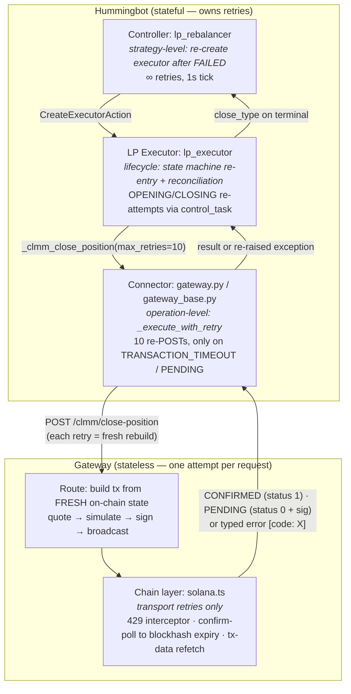
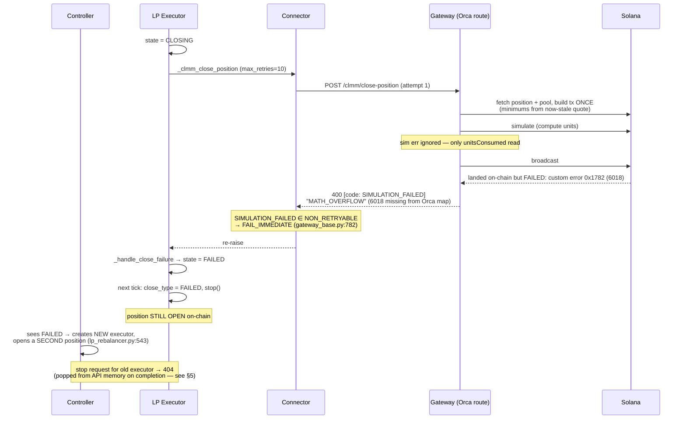
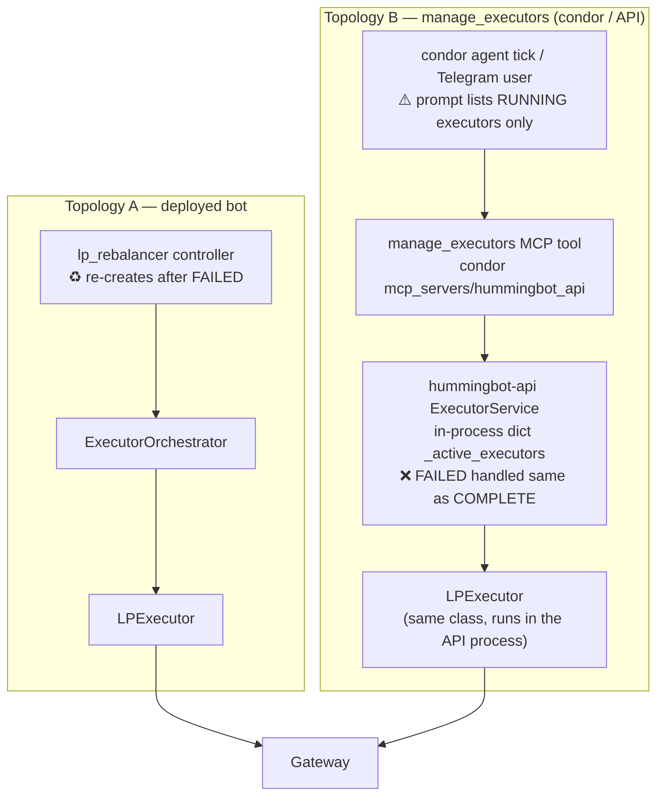
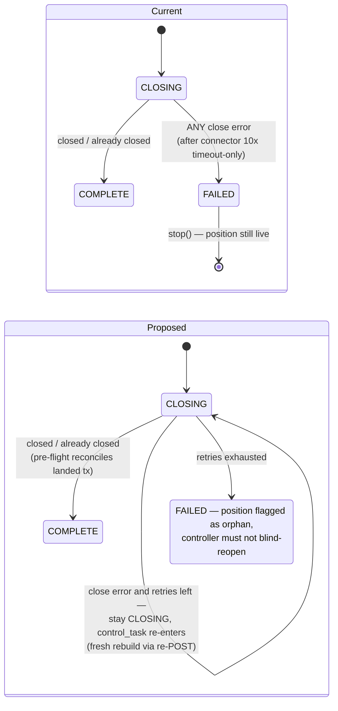

# Retry Architecture: Gateway ↔ Hummingbot

**Context:** [gateway#678](https://github.com/hummingbot/gateway/issues/678) — an Orca LP close failed with Whirlpool error `6018` (`TokenMinSubceeded`, misreported as `MATH_OVERFLOW`), the LP executor went terminally `FAILED` with the position still open on-chain, and subsequent stop requests returned 404. A proposed fix ([`040e99e`](https://github.com/hummingbot/gateway/commit/040e99ee705e7804066d9912d73751ba13a2a61a)) adds a 3-attempt rebuild-and-retry loop **inside** the gateway's Orca close route. This document formulates the canonical model for where retries live, evaluates that fix against it, and proposes changes.

---

## 1. The principle

> **Gateway is a stateless transaction oracle.** One HTTP request = one attempt at one on-chain action, built from fresh on-chain state, answered with either a confirmed result or a **typed error**. Hummingbot holds the position/order state, so Hummingbot owns retries — at three distinct altitudes, each answering a different question.

| Layer | Question it answers | Retry it owns |
|---|---|---|
| **Gateway** | "Did *this one attempt* land?" | Reads & transport only: RPC 429s, confirmation polling until blockhash expiry, tx-data re-fetch. Never re-submits a write. |
| **HB connector** (`gateway.py`, `gateway_base.py`) | "Should I ask Gateway for *another attempt*?" | `_execute_with_retry`: re-POSTs the operation (Gateway rebuilds fresh each time), max 10, only on `TRANSACTION_TIMEOUT` / `status: PENDING`. |
| **LP executor** (`lp_executor.py`) | "What does this failure mean for *the position lifecycle*?" | State-machine re-entry: `control_task` re-invokes `_create_position`/`_close_position` while state stays `OPENING`/`CLOSING`. Reconciles already-succeeded outcomes. |
| **Controller** (`lp_rebalancer.py`) | "What does this failure mean for *the strategy*?" | Re-creates a fresh executor after a `FAILED` one (unbounded, 1 s tick). **Bot topology only** — absent on the `manage_executors` path (§5). |

This principle is already written into the code on both sides:

- Gateway `raydium/clmm-routes/removeLiquidity.ts:114`: `// Transaction pending, return for Hummingbot to handle retry` → returns `status: 0` + signature.
- Gateway `solana.ts:1401-1408`: confirmation timeout throws a 504 **including the signature** so "the caller can reconcile."
- Hummingbot `lp_executor.py:594-598` docstring: "Retry logic is handled by the connector."

The key property this preserves: **a connector-level retry already gets fresh state for free**, because every POST re-runs the route's fetch → quote → build → simulate pipeline. Gateway-side write retries duplicate that loop one layer down, per-connector.

---

## 2. Retry ownership matrix (as implemented today)

What actually protects each operation, per layer. ✅ = bounded retry exists, ♻️ = unbounded, ❌ = none (failure is terminal at that layer).

| Operation | Gateway (writes) | Connector | Executor | Controller |
|---|---|---|---|---|
| **Swap** | ❌ single-shot | ✅ 10× (`_create_order`, `gateway.py:331`) — timeout only | ✅ 10× (`OrderExecutor:334-342`, any failure event) | ♻️ re-create (`lp_rebalancer.py:487`) |
| **Open position / add liq (CLMM)** | ❌ single-shot | ✅ 10× (`_clmm_add_liquidity`, `gateway.py:905`) | ❌ `_handle_create_failure:415` → `FAILED` (deliberate: a blind retry could mint a 2nd position) — but flips to `CLOSING` to recover funds if the add landed | ♻️ re-create same side (`lp_rebalancer.py:543-563`) |
| **Close position (CLMM)** | ❌ single-shot *(the proposed fix makes Orca 3×)* | ✅ 10× (`_clmm_close_position`, `gateway.py:1064`) — **timeout only** | ❌ **`_handle_close_failure:593-602` → `FAILED`, position still live on-chain** | ❌ **nothing — opens a *new* position instead** |
| AMM add/remove, partial remove | ❌ | ❌ direct await, no retry | ❌ | ❌ |
| Pending-tx polling | confirm-poll to blockhash expiry | ♻️ `update_order_status` 1 s forever | — | — |
| Reads (position/pool info) | 429 interceptor | 5 s TTL cache; **exceptions swallowed → `None`** (`gateway.py:1226-1235`) | string-matched reconciliation | — |

Two structural observations fall out of this table:

1. **Swaps are retried at three layers; closes at one.** The close's only retry (connector, 10×) fires solely on `TRANSACTION_TIMEOUT`. Every other error — including the stale-minimums slippage error at the heart of #678 — is classified `FAIL_IMMEDIATE` (`gateway_base.py:42-52`, `NON_RETRYABLE_ERROR_CODES` = `SIMULATION_FAILED`, `INSUFFICIENT_BALANCE`, `SLIPPAGE_EXCEEDED`, `INVALID_PARAMS`, `NO_ROUTE_FOUND`).
2. **The one operation that is *safest* to retry is the one with the least retry coverage.** See §3.

---

## 3. Why close differs from swap and open: idempotency

The proposed fix's justification for retrying *only* Orca close inside gateway is real, but it answers "where is retry **safe**", not "where should retry **live**".

| Operation | If the outcome is uncertain and you blindly re-submit… | Blind-retry safe? |
|---|---|---|
| Swap | Second swap also executes → **double spend** | ❌ must verify the signature first |
| Open position | Second position minted (fresh mint each attempt) → duplicate exposure | ❌ |
| Add liquidity | Deposits twice | ❌ |
| Partial remove | Removes twice | ❌ |
| **Close position** | Success **consumes the position account**; a second close fails cleanly with "position not found" | ✅ naturally idempotent |
| Collect fees | Second collect transfers ~0 | ✅ mostly |

So a bounded close-until-closed loop is *correct*. The question is only which layer runs it — and the layered answer is strictly better, because:

- **Fresh state is free at the connector layer too.** Each re-POST rebuilds quote, minimums, and blockhash. The only thing gateway-side retry buys is a few hundred ms less latency between attempts.
- **The reconciliation already exists upstream.** `lp_executor._close_position:454-486` pre-flights `get_position_info`, and maps "already closed" / "not found" → `_emit_already_closed_event()` → `COMPLETE`. The gateway fix re-implements this same reconciliation inside one route, for one connector.
- **Per-connector divergence.** There are six close-position routes (orca, meteora, raydium, pancakeswap, pancakeswap-sol, uniswap). A gateway-side loop fixes one; a hummingbot-side policy fixes all of them at once, plus every future connector.
- **Retry stacking.** The connector still wraps the route in a 10× loop. With the gateway loop inside, a timeout-flavored failure can trigger up to 10 × 3 = 30 build/submit cycles per close, invisible to the strategy. Neither layer sleeps between attempts.
- **Policy visibility.** Retry counts, backoff, and give-up conditions are strategy decisions. Buried in a route they can't be configured per-executor, surfaced in `get_custom_info`, or reasoned about from the bot.

---

## 4. Anatomy of issue #678

Note the punchline: **the proposed error-mapping fix alone doesn't change the outcome.** Mapping 6018 → `SLIPPAGE_EXCEEDED` produces a clearer message, but `SLIPPAGE_EXCEEDED` is *also* in `NON_RETRYABLE_ERROR_CODES` — correct for a swap (retrying the same quote re-fails), wrong for a close (the fix *is* rebuilding, which a re-POST does). This is why the retry decision must be **operation-aware**, and why it lives naturally in the connector, which knows which operation it is running.

---

## 5. The second topology: `manage_executors` has no controller

The stack in §1 describes a **deployed bot** running the `lp_rebalancer` controller. But users (and condor agents) also open and close LP executors directly through the `manage_executors` MCP tool, and on that path the topology is different: **the executor runs inside the hummingbot-api process, and the controller layer does not exist.**

Facts, from tracing condor + hummingbot-api:

- **`controller_id` is a label, not an owner.** `ExecutorService.create_executor` (`hummingbot-api/services/executor_service.py:424-488`) instantiates `LPExecutor` directly against a trading-interface shim and stores `controller_id` (default `"main"`, `:455`; condor agents pass their agent id, `condor/agents/prompts.py:350`) purely for filtering. No `ExecutorOrchestrator`, no `ControllerBase` is ever involved.
- **Terminal means forgotten.** The 1 s `_control_loop` (`executor_service.py:293-313`) detects `is_closed` and calls `_handle_executor_completion` (`:652-680`), which **pops the executor from memory** (`:657`), persists the final state, and returns. `CloseType.FAILED` takes the same path as `COMPLETE` — no re-creation, no alert, no orphan flag.
- **The #678 stop-404, precisely.** `stop_executor` looks up the in-memory dict and 404s on a miss (`executor_service.py:630-632`). Because the completion handler pops within one tick of the executor closing, the "already closed → 400" branch (`:634-635`) is effectively dead code — a stop against any terminal executor returns **404**. Meanwhile `GET /executors/{id}` falls back to the DB, so the agent sees an executor that is *findable but un-stoppable*. A second orphan source needs no gateway error at all: an API restart rewrites every RUNNING row to `TERMINATED/SYSTEM_CLEANUP` (`executor_service.py:229-259`) while the on-chain position lives on.
- **The condor agent cannot see the failure.** The executor summary injected into the agent's tick prompt lists **only `status == "RUNNING"`** executors (`condor/condor/agents/providers/executors.py:55-67`). A `FAILED` LP executor doesn't raise a flag — it *vanishes from view*, with a live position still on-chain. Nothing in condor branches on `close_type`; recovery exists only as prose in `guides/lp_executor.md:174-183` ("close the position via the DEX UI… manually update the executor status in the database").

Consequence for the retry model: in Topology B the ownership stack **stops at the executor**. The executor layer is the only layer present in both topologies — which makes the executor-level close retry (E1 below) the keystone fix, and means `lp_rebalancer`'s recovery duties (re-create / reconcile orphans) need a topology-B home: the `ExecutorService` completion handler and the condor data provider, not a controller.

---

## 6. Verdict on commit `040e99e`

| Piece of the fix | Verdict | Why |
|---|---|---|
| Map Orca `6018` → `SLIPPAGE_EXCEEDED` (`solana-error-parser.ts`) | ✅ **merge** | Pure correctness. Typed errors are Gateway's core job. |
| Reject simulation `err` before broadcast (`solana.ts`, both send paths) | ✅ **merge** | Fail-fast with a typed 400 instead of broadcasting a doomed tx and paying fees. Stateless. Benefits every connector. |
| 3-attempt rebuild-and-retry loop in `closePosition.ts` | ❌ **don't merge — relocate to Hummingbot** | Write-retry policy inside a stateless service; Orca-only; stacks under the connector's 10×; duplicates executor reconciliation. |
| In-route reconciliation (position gone → check attempted signature → return success) | ❌ **don't merge** | Same capability already exists at `lp_executor.py:454-486` (pre-flight) and can be reached on the next CLOSING re-entry. Keeping one reconciliation point avoids two layers disagreeing. |

---

## 7. Proposed changes

### The state machine, before and after

> **Terminal state superseded by §10:** exhaustion with the position still on-chain now terminates as an **involuntary `POSITION_HOLD`** (`hold_reason: "close_retries_exhausted"` + a zero-amount marker order carrying the position address) rather than `FAILED`; `FAILED` is reserved for exhaustion with nothing left on-chain. The `CLOSING → CLOSING` retry loop above is unchanged.

### Hummingbot — the real fix

**E1 (core). Bounded close re-entry in the executor.** `_handle_close_failure` (`lp_executor.py:593-602`): instead of jumping to `FAILED`, increment `_current_retries` and *return with state still `CLOSING`*. `control_task` (`lp_executor.py:163-167`) already re-invokes `_close_position` every tick for exactly this purpose — the machinery exists and is currently unreachable (`data_types.py:159-166` deliberately preserves `CLOSING` across updates). Bound it against `_max_retries` (implemented inline in the handler rather than via the inert `evaluate_max_retries` — same outcome, one owner); go `FAILED` only on exhaustion, with exponential backoff (capped 30 s) between attempts so instant transport failures (e.g. a Gateway restart) can't burn the budget in seconds. The pre-flight at `_close_position:454-486` gives every re-entry the timeout-but-landed reconciliation for free. Since the executor owns the retry policy, the connector's inner budget for close is cut to 3 — leaving it at 10 would stack into ~O(n²) submissions per close, the same stacking §3 rejects. This is the same loop the gateway fix implements, one layer up, for **all** connectors.

**H1. Operation-aware retry classification in the connector.** `_execute_with_retry` (`gateway_base.py:674-753`) treats `SLIPPAGE_EXCEEDED`/`SIMULATION_FAILED` as fail-immediate globally. Add a `retryable_error_codes` parameter; `_clmm_close_position` opts in to `{SLIPPAGE_EXCEEDED, SIMULATION_FAILED, TX_NOT_CONFIRMED}` because each re-POST rebuilds from fresh state and close is idempotent (§3). `TX_NOT_CONFIRMED` is the newly-typed code on the landed-but-failed branch (`status: -1`), which previously raised with no `[code:]` at all — meaning the exact #678 failure shape (tx broadcast, failed on-chain) was unretryable even with the opt-in. Swaps and opens keep today's conservative set. (E1 alone would also cover this at backoff granularity; H1 makes the fast path fast.)

**H3 (latent bug, load-bearing).** `get_position_info` (`gateway.py:1226-1235`) swallows every exception → `None`, and the executor reads `None` as "position already closed" → `COMPLETE` (`lp_executor.py:462-468`). A transient RPC error during close can therefore **abandon a live position while reporting success** — worse than #678. Three coupled requirements, each necessary:
- `None` only for a **position-specific** 404 ("Position not found…"/"Position closed…"); a bare "not found" match also catches the HTTP client's "(Not Found)" suffix on unrelated 404s (missing route after a redeploy, missing wallet file) and would report a live position as gone. Everything else re-raises.
- Existence decisions must use an **uncached** read (`get_position_info_fresh`): the 5 s `@async_ttl_cache` stores `None` like any value, so one cached 404 would be served for several consecutive 1 s ticks and masquerade as independent confirmations.
- External-close detection additionally requires the position to have been **seen on-chain at least once** plus 3 consecutive fresh misses — a not-found streak on a just-created position is RPC lag, not a close.

**C1. Controller must not blind-reopen over a live position.** `lp_rebalancer.py:543-563` re-creates after `FAILED` without checking `custom_info["position_address"]`. If the failed executor still holds a live position address: halt-and-log instead of opening a second position. The `position_hold` accounting skip at `514-518` ("no tokens deposited" — false for close failures) is deliberately retained: with the halt in place, no replacement executor is created, so there is no round trip to book; booking one would require amounts the failed close never produced. Known limitation: the halt is in-memory only — a bot restart clears it and the controller will blind-reopen; the durable guard for that case is the orphan flag + listing at the API layer (A1/A4).

**H2 (hygiene).** Add small sleep/backoff between `_execute_with_retry` attempts (today pacing relies entirely on the blocking POST), and expose `current_retries`/`max_retries` in `LPExecutor.get_custom_info` the way `OrderExecutor` does (`order_executor.py:353-354`).

### hummingbot-api & condor — the controller's duties, without a controller (Topology B)

**A1. Flag orphans at the one place every executor passes through.** `_handle_executor_completion` (`hummingbot-api/services/executor_service.py:652-680`): when `close_type == FAILED` and `custom_info` still carries a `position_address`, persist an **orphaned-position flag** on the executor record (and log at error level) instead of treating it like any other completion. Expose orphans via `/executors/search` and the positions summary so both the dashboard and agents can query them. This is `lp_rebalancer`'s "skip accounting / react to FAILED" role, relocated to the layer that actually owns Topology-B executors.

**A2. Make stop DB-aware instead of 404.** `stop_executor` (`executor_service.py:630-632`) should fall back to the DB the way `get_executor` (`:563-592`) already does: a stop against a terminal executor returns its final state as a no-op success ("already terminated, close_type=FAILED, orphaned position at X…"), and 404 is reserved for ids that never existed. This directly removes the second #678 symptom, and turns a dead end into an actionable answer for the agent.

**A3. Let the condor agent see failures.** The tick-prompt executor summary (`condor/condor/agents/providers/executors.py:55-67`) filters to RUNNING; include terminal-with-orphan executors (from A1, or minimally any recent `close_type=FAILED` with a `position_address`) in the narrative summary so the agent's next tick can react — retry the close via `manage_executors`/`manage_clmm`, or alert the user. Today the failure is silently invisible.

**A4. Codify chain-vs-tracked reconciliation.** The guides already instruct agents in prose to cross-check `positions_owned` / `get_portfolio_overview(include_lp_positions=True)` against executor `custom_info.position_address` (`condor guides/lp_executor.md:176-183`). Promote this to code: a hummingbot-api endpoint (or condor routine) that diffs on-chain positions against tracked executors and reports strays — this also catches the API-restart orphan class (`SYSTEM_CLEANUP`), which involves no gateway error at all.

### Gateway — keep it stateless

**G1. Merge** the `6018` error mapping from `040e99e`.

**G2. Merge** the simulation-`err` rejection from `040e99e` (both `sendAndConfirmTransaction` paths). This converts most stale-state failures into a pre-broadcast typed 400 — no fee spent, immediately retryable upstream.

**G3. Drop** the in-route retry/reconciliation loop from `closePosition.ts`. The route stays: fetch fresh → build → send → report, with `404 Position not found` continuing to serve as the upstream "already closed" signal.

### Rollout order

1. **G1 + G2** — small, standalone gateway PR (rebased after the Orca SDK branch merges).
2. **E1 + H1 + H3** — one hummingbot PR: makes closes retry-until-closed for every CLMM connector **and both topologies**, and fixes the false-COMPLETE hazard.
3. **A1 + A2** — hummingbot-api PR: orphan flagging on completion, DB-aware stop (kills the 404 symptom).
4. **A3 + C1** — condor provider surfaces failures to the agent; `lp_rebalancer` orphan guard for the bot topology.
5. **A4 + H2** — reconciliation endpoint/routine, backoff, retry-counter observability.

Note the leverage ordering: E1 fixes the stranding at the only layer shared by both topologies; A1–A3 exist so that *when* E1 exhausts its retries, the failure is visible and actionable instead of silently orphaning a funded position.

---

## 8. Implementation status (2026-08-12)

All of the above is implemented as uncommitted working-tree changes:

| Change | Repo / files | Notes |
|---|---|---|
| **G1** 6018 → `SLIPPAGE_EXCEEDED` | gateway: `solana-error-parser.ts` (+ test) | Ported from `040e99e` |
| **G2** simulation-`err` rejection | gateway: `solana.ts` (+ test) | Only the compute-estimation guard was still missing on `development` — the wallet chokepoint already pre-flights via `simulateWithErrorHandling`; the fix branch was based on an older base. The retry loop was **not** ported, per §6. |
| **E1** bounded close re-entry | hummingbot: `lp_executor.py` `_handle_close_failure` | Stays `CLOSING`, increments `_current_retries` (wires the dead `_max_retries_reached` field); `FAILED` only on exhaustion |
| **H1** operation-aware retry codes | hummingbot: `gateway_base.py` `_execute_with_retry`/`_classify_error`, `gateway.py` `_clmm_close_position` | Close opts in to `SLIPPAGE_EXCEEDED` + `SIMULATION_FAILED` |
| **H2** backoff + observability | hummingbot: `gateway_base.py` (1 s between attempts), `lp_executor.py` `get_custom_info` (`current_retries`/`max_retries`/`max_retries_reached`) | |
| **H3** `get_position_info` contract | hummingbot: `gateway.py` | `None` = definitive 404 only; transient errors re-raise. `_update_position_info` treats 3 consecutive definitive misses as an external close; post-create fetch guarded so a blip can't route a fresh position to `CLOSING` |
| **C1** orphan guard | hummingbot: `controllers/generic/lp_rebalancer` + mirrored in hummingbot-api `bots/controllers/...` | Halts re-creation when the FAILED executor still reports a `position_address` |
| **A1** orphan flag | hummingbot-api: `executor_service.py` | `orphaned_position: true` injected into persisted `final_state`; error-level log on completion |
| **A2** DB-aware stop | hummingbot-api: `executor_service.py`, `models/executors.py` | Terminal executor → `status="already_terminated"` no-op with `close_type`/`position_address`/`orphaned_position`; 404 only for unknown ids |
| **A4** orphan listing | hummingbot-api: `GET /executors/positions/orphaned` (router + service + repository) | DB-side: FAILED-with-position + `SYSTEM_CLEANUP` LP restarts (flagged `needs_onchain_reconciliation`) |
| **A3** agent visibility | condor: `agents/providers/executors.py`, `guides/lp_executor.md` | Orphaned executors surface in the tick-prompt narrative (`🚨 ORPHANED POSITION`) and in provider data; guide updated for the new stop/orphan contract |

Validation: gateway — targeted jest (63 passed), `tsc` and eslint clean; hummingbot — `test/hummingbot/connector/gateway/` + lp_executor suites (184 passed, incl. new contract tests), flake8 clean; hummingbot-api — syntax/import checks, pre-existing `test_gateway_lp_executor.py` staleness confirmed unrelated via stash; condor — MCP tools + executor/performance suites pass.

---

## 9. Adversarial review outcomes (2026-08-12)

Two independent adversarial reviews were run against the implementation. Confirmed findings and their resolutions:

| Finding | Severity | Resolution |
|---|---|---|
| `@async_ttl_cache` stores `None`, so one cached 404 satisfied the "3 consecutive misses" guard in 3 ticks; combined with a lagging post-create read, a **live fresh position could be falsely COMPLETEd and the controller would stack a second one** | Critical | `get_position_info_fresh` (uncached) added; all existence decisions (close pre-flight, monitoring, post-create) use it. Guard additionally gated on the position having been seen on-chain at least once. Both behaviors pinned by tests |
| "None = definitive 404" was substring-matched on "not found" — the HTTP client stamps "(Not Found)" on **every** 404, so a missing route (Gateway redeploy) or missing wallet file read as "position gone" | Critical | Match narrowed to position-specific messages (verified against actual Gateway route strings); contract pinned by a dedicated test file |
| Retry stacking: executor (11) × connector (11) = up to 121 build/submit cycles, ~1.9 h per close on timeouts — worse than the 10×3 stacking §3 condemned | Major | Connector inner budget for close cut to `min(3, max_retries)`; executor owns the policy |
| Transport errors (connection refused/5xx, no `[code:]`) fail instantly → all executor retries burned in ~11 s during a 20 s Gateway restart → permanent FAILED + halt | Major | Exponential backoff (2ⁿ s capped at 30 s) between executor close attempts; a Gateway restart now spans a few retries instead of all of them |
| Landed-but-failed close (`status: -1`) raised with no error code → unretryable even with the H1 opt-in — the flagship #678 shape missed the fast path | Major | Raise now typed `[code: TX_NOT_CONFIRMED]`; close opts in |
| Agent-facing recovery text said a "fresh lp_executor" could recover an orphan — it cannot (configs have no adoption field); following it would mint a second position | High | Wording corrected everywhere (provider, guide, MCP outputs): gateway-side close by position address, then `resolve_orphan` |
| `GET /executors/positions/orphaned` was unreachable from the MCP tool it was documented for | High | `manage_executors` gained `orphaned` and `resolve_orphan` actions (raw-HTTP passthrough, same pattern as `get_logs`) |
| Orphan listing applied `limit` to mixed candidates then filtered in Python — restarts/failed swaps could push real orphans past the newest 500 and return a false "no orphans" | Med-High | `executor_type='lp_executor'` filter moved into SQL (the only type owning position accounts); DB errors now raise instead of returning `[]` |
| No way to ever silence a recovered orphan — 🚨 warnings forever | Medium | `POST /executors/{id}/resolve-orphan` sets `orphan_resolved` in the final state; listing, provider, and warnings all skip resolved records |
| "404 = never existed" was overclaimed: completion race, failed persist, or DB blip still 404'd a real executor | Medium | Stop now treats any DB-known, not-in-memory executor as `already_terminated` regardless of stored status (reconciling stale RUNNING rows); docs soften the 404 meaning |
| Telegram handler and MCP stop output showed "✅ stopped" for a no-op stop, hiding the orphan payload | Medium | Both presenters branch on `already_terminated` and surface the orphan warning |

### Live smoke test (2026-08-12)

The hummingbot wheel was rebuilt (`hummingbot-20260729-cp312`, macOS arm64) and force-reinstalled into the `hummingbot-api` conda env; import inspection confirmed the installed package carries every change (fresh reads, opt-in codes, `TX_NOT_CONFIRMED`, E1 backoff, seen-gate). The patched gateway ran in dev mode on :15889 (the production container on :15888 untouched), and the **H3 contract was verified end-to-end through the installed wheel against the live gateway** — all read-only, no on-chain writes:

1. Nonexistent position on a live Orca route → connector returns `None` (`"Position not found or closed: …"` 404) ✅
2. Nonexistent connector route (the HTTP client stamps `(Not Found)` on it) → connector **raises** instead of `None` ✅
3. Dead gateway port → connector raises `ClientConnectorError` ✅

The smoke test also caught two live gateway bugs, both fixed and re-verified:

- **Close-position on a missing position returned a generic 500**, not the 404 callers reconcile on: the legacy whirlpool SDK's `getPosition` *throws* (`"Unable to fetch Position at address…"`) instead of returning null, so the route's not-found branch was dead code. The close route now maps that throw to `404 Position not found`.
- **`Orca.getPositionInfo` swallowed *every* error into `null`** — meaning a transient RPC failure inside Gateway was served as the definitive `"Position not found or closed"` 404, silently reopening the abandon-live-position hole one layer *below* the H3 connector fix. It now returns null only for the SDK's definitive account-missing throw and rethrows everything else (transient errors surface as 500s with no position-specific text → the connector raises). Both behaviors pinned by tests; 216 gateway tests pass.

### Docker rebuild + funded live test (2026-08-12)

Both production containers were rebuilt with the patched code and the full cycle was run with real funds on Orca mainnet:

- **Images**: a linux-arm64 wheel (`hummingbot-20260729-cp312-linux_aarch64`) was built in a container from the patched source and layered onto `hummingbot/hummingbot-api:latest` together with the updated API source (`Dockerfile.patched-hummingbot`); `hummingbot/gateway:development` was rebuilt from the patched checkout. Both containers were recreated with identical wiring (conf/cert volumes, `emqx-bridge` network, 127.0.0.1 port binds); in-container inspection confirmed the patched code, and the new routes appeared in the live OpenAPI spec.
- **Funded cycle** (wallet `82Sgg…qyHx5`, Topology B via `POST /executors/`): opened a RANGE lp_executor on the Orca SOL-USDC 0.04% whirlpool (`Czfq…44zE`) with 0.04 SOL + 3 USDC → position `6hep…Hkup` live on-chain, `IN_RANGE`, amounts verified independently through the gateway. Stopped with `keep_position=true` → `CLOSING` → closed on-chain first-attempt (`current_retries: 0/10` visible in `custom_info` — H2 observability live), `POSITION_HOLD/COMPLETE`, full rent refunded (0.01006 SOL), fees earned recorded, total tx cost ~0.00004 SOL.
- **Post-close verification**: gateway position-info returns the position-specific 404 for the closed position; a second stop returned `status: "already_terminated"` with final `close_type` — **the exact #678 dead-end (stop → 404) is gone in production**; `/executors/positions/orphaned` correctly empty.
- **Bonus real-world failure exercised**: the first create attempt failed on a public-RPC rate limit — the executor went `FAILED` with **no** position address, was correctly **not** flagged as an orphan (nothing landed on-chain, no funds spent), and the fix was a conf change (QuickNode RPC) + retry. Exactly the intended failure semantics for the open path.

### Close-failure stress test (2026-08-12)

**Natural stress: 5× narrow open→close cycles.** Five positions opened at ±0.07% around the live price on the SOL-USDC 0.04% whirlpool and closed immediately — all five closed first-attempt (`close_retries: 0`), full rent refunded, zero orphans. The natural 6018 race is effectively unreachable on this branch because the legacy-SDK close route quotes withdrawal minimums with a **50% slippage buffer** (the fix branch's SDK rework quotes at the configured `slippagePct` — which is what made #678 possible at ~1%).

**Forced failure: fault-injected gateway image.** To exercise the full failure machinery deterministically, a throwaway `gateway:close-stress-test` image set the close instruction's token minimums to 2×actual+1 — guaranteeing Whirlpool `6018 TokenMinSubceeded` on every attempt. One funded position (`9xiY…D4tW`) was opened and stopped against it. Observed, end to end on production containers:

1. **G2 made every failed attempt free**: each of the 33 gateway POSTs (11 executor attempts × 3 connector retries) was rejected by the compute-simulation guard *before broadcast* — zero fees burned across the entire cascade.
2. **H1 opt-in retried at the connector**: 3 inner attempts per executor attempt, ~1.8 s apart.
3. **E1 bounded re-entry with visible backoff**: `close_retries` climbed 0→11 over ~5 minutes with the exponential backoff plainly in the timestamps (2, 4, 8, 16, then 30 s capped), each re-entry rebuilding from fresh state.
4. **Terminal + A1**: exhaustion → `FAILED`, `max_retries_reached: true`, `orphaned_position: true` in the persisted state, error-level orphan log pointing at the recovery endpoint.
5. **A4/A2 live**: `/executors/positions/orphaned` listed the record with the position address; re-stop returned `already_terminated` + `orphaned_position: true` + the address — the actionable payload instead of a 404.
6. **Recovery**: gateway restored to the normal image → direct close succeeded first try (all funds + rent recovered) → `resolve-orphan` cleared the listing and the flag.

**The forced failure also caught a real parser bug** — the same misreporting #678 complained about, in a shape unit tests missed: `extractProgramId` matched the *first* `Program X invoke|failed` in the message, and simulation logs open with prelude programs (ComputeBudget), so the failing DEX program's error table was never consulted and Orca 6018 fell through to the generic map's `MATH_OVERFLOW` / `SIMULATION_FAILED`. The close survived anyway **only because** the opt-in set includes both `SIMULATION_FAILED` and `SLIPPAGE_EXCEEDED` — defense-in-depth proving its worth live. Fixed: the parser now attributes a custom error to the program on the `failed: custom program error` line (regression test with a full simulation-shaped log; 53 parser tests pass), and the rebuilt `gateway:development` image carries the fix. Also fixed from live observation: an off-by-one that ran `max_retries + 1` close attempts while logging `n/max`. The hummingbot-api image was subsequently rebuilt with the corrected wheel and redeployed; a 2-cycle funded open/close retest on the same pool passed clean (0 retries, rent refunded, 0 orphans), so the deployed stack is fully current with source.

Accepted residual risks (documented, not fixed):
- **C1 halt is process-local** — a bot restart clears it and the controller can blind-reopen; the durable guard is the API-layer orphan flag/listing, which is Topology-B infrastructure. A bot-side persistent guard would need controller state persistence that doesn't exist today.
- **Force-stop stragglers** — `force_stop_with_position_hold` doesn't cancel an in-flight `_clmm_close_position`; a lingering attempt can land *after* the executor is persisted FAILED-with-position, making the orphan flag stale-wrong. `resolve_orphan` (after an on-chain check) is the correction path.
- **Deployment coupling** — hummingbot-api runs the *installed* hummingbot wheel; E1/H1/H3 reach Topology B only after the wheel is rebuilt and reinstalled (see `~/.claude/CLAUDE.md` build steps). Until then the API-side changes are live but the executor still hard-fails closes.
- **SYSTEM_CLEANUP orphans have no position address** (final state was never persisted) — they are listed as `needs_onchain_reconciliation` rather than resolved automatically.

---

## 10. Redesign: exhausted close ends as an involuntary POSITION_HOLD (2026-08-12)

§7's terminal state — `FAILED` with the position flagged as an orphan — solved #678 but required a parallel side-channel (the `orphaned_position` flag, the orphan listing, the C1 halt, condor prompt injection) at every layer. Surveying how the rest of the executor family handles failure shows why: **we picked the wrong terminal close type**, and every consumer then needed bespoke plumbing to compensate. This section supersedes the terminal-state design in §7 (E1's *retry loop* is unchanged — it matched the family all along).

### What the executor family already does

- **In-executor bounded retry is the standard, not an LP invention.** Order, grid, DCA and TWAP executors all increment `_current_retries` on failure and stay in state; the base class's `control_loop` calls `evaluate_max_retries()` after every `control_task`, and that hook terminates the executor when `_current_retries > _max_retries` (`executor_base.py:254-262`). E1 re-implemented exactly this shape inline.
- **`FAILED` means "abnormal end with *no residual exposure*".** `force_stop_with_position_hold` (`executor_base.py:241-252`) sets `POSITION_HOLD if held_orders else FAILED`: anything that still represents exposure terminates as a hold with `held_position_orders`; `FAILED` is reserved for executors with nothing left behind.
- **The hold channel has a real consumer on both topologies.** The orchestrator folds `held_position_orders` from `POSITION_HOLD` executors into durable `PositionHold` records (`executor_orchestrator.py:585-640`); hummingbot-api's `ExecutorService` has the same machinery independently, **including recovery from the database on restart** (`executor_service.py:159-224`). Ending close-exhaustion as `FAILED` bypassed all of it.

### The constraint: a live LP position is not spot exposure

`PositionHold` is a spot net-position accumulator (amounts, avg entry, realized PnL). A still-open on-chain position cannot be booked as spot amounts — the tokens sit in the pool, not the wallet — which is exactly why the forced-stop path logs "an on-chain position cannot be represented as spot orders" (`lp_executor.py:986-1005`) instead of inventing amounts. The LP executor already has the answer for "report something without booking anything": the **zero-amount marker order** (`lp_executor.py:904-921`), which `PositionHold._process_order` skips (`amount_base == 0` returns early) while still making `held_position_orders` non-empty and carrying metadata.

### The design

1. **`_handle_close_failure` only counts and paces.** It increments `_current_retries`, arms the exponential backoff, and stays `CLOSING`. The terminal decision moves out of the handler and into the family hook.
2. **`evaluate_max_retries` is overridden in `lp_executor`** (previously inert there). Base semantics (`>`, i.e. `max_retries + 1` total attempts — the family convention; this supersedes the `>=` change from §9's stress test) decide *when*; the override decides *how*:
   - **Position still on-chain** → append a zero-amount marker order carrying `position_address`, `lp_unclosed_position: true`, and the tx fees burned so far; set `hold_reason: "close_retries_exhausted"`; terminate as **`POSITION_HOLD`**. Accounting is untouched (zero amounts), but the hold — with the position's identity — lands in the durable hold store on both topologies.
   - **No position** (close exhausted after the position turned out to be gone, or a failure path with nothing on-chain) → `FAILED`, now true to its family meaning.
3. **Voluntary vs involuntary holds are distinguished by `hold_reason`**, not by close type. A `keep_position=True` stop and an exhausted close both end `POSITION_HOLD`; only the latter carries `hold_reason` (and the marker order instead of a net-trade order).
4. **Consumers key off the reason, not `FAILED`:**
   - `lp_rebalancer`: the halt-and-log guard (C1) now triggers on an involuntary hold (`hold_reason` set) as well as legacy `FAILED`-with-position; the accounting branch must **also skip** involuntary holds — their `base_amount`/`quote_amount` are pool balances of a still-open position, and booking them as returned tokens would corrupt `position_hold` tracking.
   - hummingbot-api: `orphaned_position` flag injection, the orphan listing, and `resolve-orphan` accept the `POSITION_HOLD`+`hold_reason` shape (legacy `FAILED`-with-position and `SYSTEM_CLEANUP` remain as defense for force-stop stragglers and restarts). The orphan listing becomes a *view* over involuntary holds rather than a parallel mechanism.
   - condor: the provider's orphan filter already keys off the injected flag, so it picks up the new shape automatically; guide wording updates from "FAILED with position" to "involuntarily held".

### What this closes

- **The C1 restart residual shrinks**: the involuntary hold is persisted in the hold store (DB-recovered on the API path) rather than living only in a controller field.
- **Family semantics restored**: `FAILED` again implies nothing-left-on-chain; dashboards and PnL reports that special-case `POSITION_HOLD` see the exposure through the same lens as every other executor's residue.
- **One mental model for users**: condor users already understand `POSITION_HOLD` from `keep_position=True` stops; an exhausted close is the same object with a reason attached, not a new 🚨 concept.

### Implementation status (2026-08-12, uncommitted)

| Change | Repo / files |
|---|---|
| `_handle_close_failure` counts + paces only; `evaluate_max_retries` override terminates (involuntary `POSITION_HOLD` + marker order with live position, `FAILED` without); `_hold_reason` in `get_custom_info`; family `>` semantics restored | hummingbot: `lp_executor.py` (+ contract tests, 140 pass) |
| Accounting skip + halt guard keyed on `hold_reason` as well as legacy `FAILED`-with-position; closed-bounds capture excludes involuntary holds | hummingbot `controllers/generic/lp_rebalancer` + hapi `bots/controllers/...` mirror |
| Orphan flag injection, listing, and resolve accept the `POSITION_HOLD`+`hold_reason` shape; `hold_reason` in stop/orphan payloads and models; router docs | hummingbot-api: `executor_service.py`, `models/executors.py`, `routers/executors.py` |
| Provider orphan filter adds the `hold_reason` shape; prompt/guide wording updated from "terminated FAILED" to reason-aware | condor: `agents/providers/executors.py`, `guides/lp_executor.md` (146 tests pass) |

Deliberately unchanged: `force_stop_with_position_hold` still ends a live-position forced stop as `FAILED` (the close may still be in flight at the shutdown deadline; the legacy `FAILED`-with-position orphan class covers it), and the zero-amount marker is not emitted there. The deployed hapi image predates this redesign until the next wheel/image rebuild.

### Live validation (2026-08-12, rebuilt stack)

Wheel → image → funded-retest pipeline re-run with the §10 redesign deployed (linux wheel rebuilt in-container, hapi image relayered, container recreated; in-container checks confirmed the involuntary-hold code and `hold_reason` plumbing).

**Clean cycles (normal gateway image):** two funded open/close cycles on the SOL-USDC whirlpool closed first-attempt (`POSITION_HOLD`/`COMPLETE`, 0 retries, rent refunded, orphan listing empty). A bonus negative test happened naturally: two *opens* were rejected at simulation with Orca `0x177c` (`TokenMaxExceeded` — fast-moving market vs a ±0.07% range) and terminated `FAILED` **with nothing on-chain and no orphan record** — `FAILED`'s restored family meaning, observed live at zero fee cost.

**Forced cascade (fault-injected image, minimums 2×actual+1):** position `ApT4…Qk8A`, executor `C5y3…sTrG`:
- 11 close attempts (`max_retries + 1`, family `>` semantics) over ~5 min with the 2/4/8/16/30 s backoff visible in the timestamps; every attempt rejected pre-broadcast (zero fees).
- Terminal: `close_type: POSITION_HOLD`, `hold_reason: close_retries_exhausted`, `max_retries_reached: true`, and the zero-amount marker order in `held_position_orders` carrying the position address (`lp_unclosed_position: true`).
- `orphaned_position: true` injected; `/positions/orphaned` listed the `POSITION_HOLD` record with `hold_reason`; re-stop returned `already_terminated` + reason.
- Recovery: normal image restored → direct close first-attempt (0.0174 SOL + 1.448 USDC + fees + 0.0100572 rent recovered) → `resolve-orphan` accepted the `POSITION_HOLD` candidate and cleared the listing. Fault image deleted.

### Rebase note: Orca SDK migration (gateway#676)

The Orca connector's migration to the current whirlpools SDK merged into `development` while this work was in flight, which changed the gateway-side surface:

- The new close route quotes at `slippageToleranceBps` from the connector config (~1%) instead of the legacy route's 50% buffer — the exact condition under which #678 was reachable. The chain-level guards (G1/G2) and the Hummingbot-side retry ownership are therefore **load-bearing** on the new SDK, not defense-in-depth.
- The legacy-SDK `closePosition` 404 mapping is obsolete: the new route uses `fetchMaybePosition` and 404s a missing position natively.
- The `getPositionInfo` null-contract fix (H3) was **ported**: the migrated implementation again swallowed every error to `null`, so it now uses `fetchMaybePosition` for a definitive "account does not exist" → `null`, and lets everything else throw.
